# Computer Science Y1 P3 Combined Portfolio

This file is auto-generated by `combine_portfolios.py`.
 - master repository: https://github.com/pop9459/P3-Portfolio
 - updated at: 2026-04-01T23:02:02

## Table of Contents

- [Solo Innovator Y1 P3](#solo-innovator-y1-p3)
- [Digital portfolio Computer Science Y1 P3](#digital-portfolio-computer-science-y1-p3)
  - [Assignment card](#assignment-card)
  - [Smart Cafe helper](#smart-cafe-helper)
  - [Vanity plates goes Flask](#vanity-plates-goes-flask)
  - [Survival simulator](#survival-simulator)
  - [Testing my twttr](#testing-my-twttr)
  - [Bank testing](#bank-testing)
  - [Fuel testing](#fuel-testing)
  - [Plates testing](#plates-testing)
  - [T-shirt](#t-shirt)
  - [Product goes OOP](#product-goes-oop)
  - [Tic-Tac-Toe](#tic-tac-toe)
  - [The misleading minesweeper](#the-misleading-minesweeper)
- [Digital portfolio Embedded systems Y1 P3](#digital-portfolio-embedded-systems-y1-p3)
  - [Assignment card](#assignment-card-1)
  - [Blink with hardware reset](#blink-with-hardware-reset)
  - [Mario pico](#mario-pico)
  - [7-Segments Voltmeter (0..10V)](#7-segments-voltmeter-010v)
  - [RTC and temperature on LCD-display](#rtc-and-temperature-on-lcd-display)
  - [Dino cheater (HID)](#dino-cheater-hid)
  - [Analog joystick (HID)](#analog-joystick-hid)
  - [WiFi scanner](#wifi-scanner)
  - [Controlling stuff (Webserver)](#controlling-stuff-webserver)
  - [Attendance (RFID, RTC, web and LCD)](#attendance-rfid-rtc-web-and-lcd)
- [Digital portfolio Professional Skills Y1 P3](#digital-portfolio-professional-skills-y1-p3)
  - [Setting & Achieving Goals: SMART(ER)](#setting-achieving-goals-smarter)
  - [Prioritizing Using the Time Management Matrix](#prioritizing-using-the-time-management-matrix)
  - [Feedback](#feedback)

---

# Solo Innovator Y1 P3
- Name: Peter Kapsiar
- Student ID: 5486866
- Repository: https://github.com/pop9459/AutomaticCourtainBlinder

### Description
The project is focused on creating an automated system for opening and closing window courtains. The system uses a raspberry pi pico w microcontroller to control a stepper motor to pull strings attached to the curtains. The system can be controlled via physical buttons or remotely via API endpoints. The whole system is powered by a solar panel and a power bank. 

Components used:
- Raspberry Pi Pico W
- Neema 17 stepper motor
- A4988 stepper motor driver
- 2x buttons
- 2x 10k ohm resistors

During the project there was some accidental damage to the stepper motor driver which is why in the demo video I replaced the motor and the driver with a smaller stepper motor and a different driver. 

The project is inspired by a similar project from the youtube channel: "DIY Machines" (https://www.youtube.com/@DIYMachines) with the video "DIY - Alexa Curtain Control System - (3D Printable, Echo, Adafruit Feather Huzzah ESP8266)" (https://www.youtube.com/@DIYMachines)

### Schematic

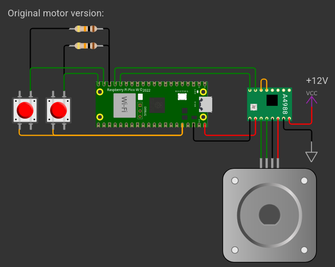
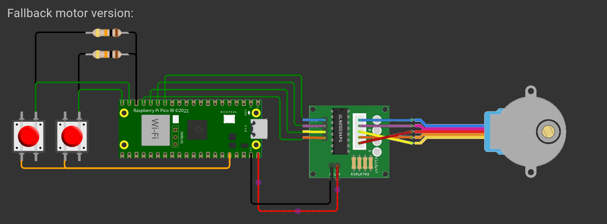

### Code
`main.py`
```python
import socket
import network
from machine import Pin

from position_db import PositionDB
from stepper_motor import make_motor
from web_server import connect_wifi, send_response

LEFT_BUTTON_PIN = 14
RIGHT_BUTTON_PIN = 15

positions_db = PositionDB()
stored_positions = positions_db.load_positions()
current_position = stored_positions["current_position"]
position_open = stored_positions["position_open"]
position_closed = stored_positions["position_closed"]

if not connect_wifi():
    raise RuntimeError("WiFi connection failed")

ip = network.WLAN(network.STA_IF).ifconfig()[0]
print("Pico IP:", ip)

motor = make_motor(pin1=10, pin2=11, pin3=12, pin4=13, delay=0.001, reverse=False)
motor.set_mode("half")

left_button = Pin(LEFT_BUTTON_PIN, Pin.IN, Pin.PULL_DOWN)
right_button = Pin(RIGHT_BUTTON_PIN, Pin.IN, Pin.PULL_DOWN)

addr = socket.getaddrinfo("0.0.0.0", 80)[0][-1]
s = socket.socket()
try:
    # Helps after soft reboot when the previous socket is still in use briefly.
    s.setsockopt(socket.SOL_SOCKET, socket.SO_REUSEADDR, 1)
except AttributeError:
    # Some MicroPython builds may not expose all socket constants/options.
    pass

try:
    s.bind(addr)
except OSError as exc:
    if exc.args and exc.args[0] == 98:
        s.close()
        raise RuntimeError(
            "Port 80 is already in use. Stop other web server scripts or hard-reset the Pico."
        )
    raise
s.listen(1)
s.settimeout(0.05)


def persist_positions():
    positions_db.save_positions(current_position, position_open, position_closed)


def step_with_tracking(logical_direction, steps=1):
    """Move motor and track logical position."""
    global current_position

    if steps <= 0:
        return

    if logical_direction > 0:
        motor.step_forward(steps)
    else:
        motor.step_backward(steps)

    current_position += logical_direction * steps
    motor.stop()


def move_to_position(target_position):
    delta = target_position - current_position
    moved = False

    if delta > 0:
        step_with_tracking(1, delta)
        moved = True
    elif delta < 0:
        step_with_tracking(-1, -delta)
        moved = True
    else:
        motor.stop()

    if moved:
        persist_positions()


def handle_manual_drive():
    """Step continuously while a manual button is held."""
    moved = False

    while True:
        left_pressed = left_button.value() == 1
        right_pressed = right_button.value() == 1

        if left_pressed and not right_pressed:
            step_with_tracking(-1, 1)
            moved = True
        elif right_pressed and not left_pressed:
            step_with_tracking(1, 1)
            moved = True
        else:
            motor.stop()
            if moved:
                persist_positions()
            return

while True:
    left_pressed = left_button.value() == 1
    right_pressed = right_button.value() == 1

    if left_pressed or right_pressed:
        handle_manual_drive()
        continue

    client = None
    try:
        try:
            client, client_addr = s.accept()
        except OSError:
            # No client connected within timeout; continue polling buttons.
            continue

        client.settimeout(2)
        request = client.recv(1024).decode()
        request_line = request.split("\r\n", 1)[0]
        print("Request from", client_addr, request_line)

        if request_line.startswith("GET /set/open "):
            position_open = current_position
            persist_positions()
            send_response(client, '200 OK', 'text/plain', 'OPEN_SET={}'.format(position_open))
        elif request_line.startswith("GET /set/close "):
            position_closed = current_position
            persist_positions()
            send_response(client, '200 OK', 'text/plain', 'CLOSE_SET={}'.format(position_closed))
        elif request_line.startswith("GET /move/open "):
            if position_open is None:
                send_response(client, '400 Bad Request', 'text/plain', 'Open position not set')
            else:
                move_to_position(position_open)
                send_response(client, '200 OK', 'text/plain', 'MOVED_OPEN position={}'.format(current_position))
        elif request_line.startswith("GET /move/close "):
            if position_closed is None:
                send_response(client, '400 Bad Request', 'text/plain', 'Closed position not set')
            else:
                move_to_position(position_closed)
                send_response(client, '200 OK', 'text/plain', 'MOVED_CLOSE position={}'.format(current_position))
        elif request_line.startswith("GET /reset/positions "):
            positions_db.reset_positions()
            current_position = 0
            position_open = None
            position_closed = None
            motor.stop()
            send_response(client, '200 OK', 'text/plain', 'POSITIONS_RESET current=0 open=None close=None')
        else:
            send_response(
                client,
                '404 Not Found',
                'text/plain',
                'Use /set/open, /set/close, /move/open, /move/close, /reset/positions',
            )
    except Exception as exc:
        motor.stop()
        if client is not None:
            try:
                send_response(client, '500 Internal Server Error', 'text/plain', str(exc))
            except Exception:
                pass
    finally:
        if client is not None:
            client.close()
```

`position_db.py`
```python
try:
    import ujson as json
except ImportError:
    import json


class PositionDB:
    def __init__(self, filename="positions.json"):
        self.filename = filename

    def load_json_file(self, filename):
        try:
            with open(filename, "r") as f:
                return json.load(f)
        except Exception:
            return {}

    def save_json_file(self, filename, data):
        with open(filename, "w") as f:
            json.dump(data, f)

    def load_positions(self):
        data = self.load_json_file(self.filename)
        if not isinstance(data, dict):
            data = {}

        return {
            "current_position": data.get("current_position", 0),
            "position_open": data.get("position_open", None),
            "position_closed": data.get("position_closed", None),
        }

    def save_positions(self, current_position, position_open, position_closed):
        self.save_json_file(
            self.filename,
            {
                "current_position": current_position,
                "position_open": position_open,
                "position_closed": position_closed,
            },
        )

    def reset_positions(self):
        self.save_positions(0, None, None)
```

`stepper_motor.py`
```python
"""Simple stepper motor library for ULN2003 + 28BYJ-48 style motors.

MicroPython compatible.
"""

from machine import Pin
import time


FULL_STEP_SEQUENCE = [
    (1, 0, 0, 0),
    (1, 1, 0, 0),
    (0, 1, 0, 0),
    (0, 1, 1, 0),
    (0, 0, 1, 0),
    (0, 0, 1, 1),
    (0, 0, 0, 1),
    (1, 0, 0, 1),
]


HALF_STEP_SEQUENCE = [
    (1, 0, 0, 0),
    (1, 1, 0, 0),
    (0, 1, 0, 0),
    (0, 1, 1, 0),
    (0, 0, 1, 0),
    (0, 0, 1, 1),
    (0, 0, 0, 1),
    (1, 0, 0, 1),
]


class StepperMotor:
    """Very small helper class to drive a 4-wire stepper via ULN2003."""

    def __init__(self, in1, in2, in3, in4, delay=0.002, reverse=False):
        self.pins = [in1, in2, in3, in4]
        self.delay = delay
        self.step_index = 0
        self.sequence = FULL_STEP_SEQUENCE
        self.reverse = bool(reverse)

    def set_mode(self, mode="full"):
        if mode == "half":
            self.sequence = HALF_STEP_SEQUENCE
        else:
            self.sequence = FULL_STEP_SEQUENCE

    def _set_pins(self, pattern):
        for pin, state in zip(self.pins, pattern):
            pin.value(state)

    def set_reverse(self, reverse=False):
        self.reverse = bool(reverse)

    def _step_actual_direction(self, actual_direction, steps=1):
        if actual_direction > 0:
            for _ in range(steps):
                self._set_pins(self.sequence[self.step_index])
                self.step_index = (self.step_index + 1) % len(self.sequence)
                time.sleep(self.delay)
        else:
            for _ in range(steps):
                self.step_index = (self.step_index - 1) % len(self.sequence)
                self._set_pins(self.sequence[self.step_index])
                time.sleep(self.delay)

    def step_forward(self, steps=1):
        actual_direction = -1 if self.reverse else 1
        self._step_actual_direction(actual_direction, steps)

    def step_backward(self, steps=1):
        actual_direction = 1 if self.reverse else -1
        self._step_actual_direction(actual_direction, steps)

    def rotate(self, degrees, steps_per_revolution=2048):
        steps = int(abs(degrees) / 360 * steps_per_revolution)
        if degrees >= 0:
            self.step_forward(steps)
        else:
            self.step_backward(steps)

    def stop(self):
        self._set_pins((0, 0, 0, 0))


def make_motor(pin1=16, pin2=17, pin3=18, pin4=19, delay=0.002, reverse=False):
    """Convenience factory using default Pico GPIO pins 16-19."""
    return StepperMotor(
        Pin(pin1, Pin.OUT),
        Pin(pin2, Pin.OUT),
        Pin(pin3, Pin.OUT),
        Pin(pin4, Pin.OUT),
        delay=delay,
        reverse=reverse,
    )
```

`web_server.py`
```python
try:
    import ujson as json
except ImportError:
    import json

import time
import network
from secrets import SSID, PASSWORD


def connect_wifi(timeout=15):
    """Connect to WiFi network. Returns True if connected, False otherwise."""
    nic = network.WLAN(network.WLAN.IF_STA)
    nic.active(True)

    if not nic.isconnected():
        print('Connecting to WiFi...')
        nic.connect(SSID, PASSWORD)
        # wait for connection (timeout after ~15 seconds)
        while not nic.isconnected() and timeout > 0:
            time.sleep(1)
            timeout -= 1

    if nic.isconnected():
        print('Connected, network config:', nic.ifconfig())
        return True
    else:
        print('Failed to connect to WiFi. Check SSID/PASSWORD')
        return False


def send_response(conn, status, content_type, body):
    conn.send(('HTTP/1.1 {}\r\n'.format(status)).encode())
    conn.send(('Content-Type: {}\r\n'.format(content_type)).encode())
    conn.send('Connection: close\r\n\r\n'.encode())
    conn.send(body.encode())


def send_json(conn, status, payload):
    send_response(conn, status, 'application/json', json.dumps(payload))


def serve_file(conn, filepath, status='200 OK', content_type='text/html'):
    """Serve a file from the filesystem."""
    try:
        with open(filepath, 'r') as f:
            body = f.read()
        send_response(conn, status, content_type, body)
        return True
    except OSError:
        return False
```

`secrets.py`
```python
# WiFi credentials 
SSID = "YOUR_NET_SSID"
PASSWORD = "YOUR_NET_PASS"
```

### Output

overview video: https://youtu.be/afZEDE46g-k?si=IUZLnpNUe_IK7F3g


# Digital portfolio Computer Science Y1 P3
- Name: Peter Kapsiar
- Student ID: 5486866
- Repository: https://github.com/pop9459/P3-ComputerScience

## Assignment card

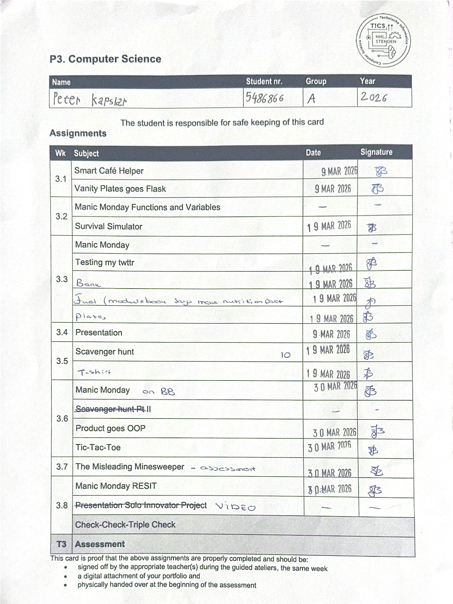

## Smart Cafe helper

### Description
This is a simple command-line application that simulates a cafe ordering system. It allows users to customize a welcome message, place orders for various items, calculate the energy of the items based on their weight and type, and process tips for the total order price. The application demonstrates the use of functions, loops, conditionals, and user input handling in Python.

### Code
`main.py`
```python
def welcome_message():
    welcome_message = "Welcome to Smart Cafe!"
    print(welcome_message)

    user_input = input("Would you like to customize the welcome message? (yes/no): ").lower()
    if user_input == "yes":
        welcome_message = input("Enter your custom message: ")

    print(transform_message(welcome_message))

def transform_message(input_message):
    new_message = ""
    for char in input_message:
        new_message = new_message + char + "..."
    
    new_message = new_message.removesuffix("...")

    return new_message

def process_orders():
    total_order_price = 0

    # do while loop
    while True:
        # Get order item
        user_input = input("Please enter your order or type 'done' to finish: ").lower()
        order_output = get_item_type(user_input)
        if(order_output == False):
            break
        else:
            energy_coeficient = order_output

        # Calculate energy
        user_input = input("Would you like to calculate energy? (yes/no): ").lower()
        if(user_input == "yes"):
            print(f"Energy: {calculate_energy(energy_coeficient)} Joules")

        # Increment price
        total_order_price += get_item_price()

    print(f"Your total is ${total_order_price}.")

    price_after_tip = process_tip(total_order_price)
    print(f"With tip, your total is: ${price_after_tip}")

def process_tip(price_before_tip):
    while True:
        user_input = float(input("How much tip would you like to add? (10, 15, 20): "))
        price_after_tip = price_before_tip + price_before_tip * (user_input / 100)

        return price_after_tip

def get_item_type(user_input):
        match user_input:
            case "done":
                #finish ordering
                return False
            case "coffe":
                order_item = "☕"
                energy_coeficient = 1
            case "tea":
                order_item = "🫖"
                energy_coeficient = 2
            case "cake":
                order_item = "🍰"
                energy_coeficient = 3
            case "cookie":
                order_item = "🍪"
                energy_coeficient = 4
            case "cheese":
                order_item = "🧀"
                energy_coeficient = 5
            case _:
                order_item = user_input.lower()
                energy_coeficient = 0.5
                pass

        print("Okay, I will prepare " + order_item)
        return energy_coeficient

def get_item_price():
    user_input = input("Please enter the price of this item: ")
    item_price = float(user_input.removeprefix("$"))
    return item_price
    

def calculate_energy(energy_coeficient):
    item_weight = float(input("Enter the weight in grams: "))
    item_energy = item_weight * pow(energy_coeficient, 2)
    return item_energy


if __name__ == "__main__":
    welcome_message()
    process_orders()
    print("Thank you for visiting Smart Cafe!")
```

## Vanity plates goes Flask

### Description
This is a simple Flask API that allows users to validate and register vanity license plates. The API provides endpoints for validating a plate, registering a plate, and listing all registered plates. The application uses an SQLite database to store the registered plates and includes a function to check the validity of the plates based on specific criteria.

### Code
`main.py`
```python
from endpoints import *
from db_handler import *


# ##### Main execution #####
if __name__ == "__main__":
    db_initialize()
    flask_api.run(debug=True)
```

`endpoints.py`
```python
from flask import Flask, jsonify, request
from db_handler import *
from plate_checker import *

# ##### Object initialization #####
flask_api = Flask(__name__)

# ##### Define the API endpoints #####
@flask_api.get("/")
def index():
    return jsonify({"message": "Vanity plate API is running"})

@flask_api.post("/validate")
def validate_plate():
    # Get the JSON data from the request.
    data = request.get_json(silent=True) or {}
    plate = data.get("plate", "")

    if not isinstance(plate, str):
        return jsonify({"error": "'plate' must be a string"}), 400

    return jsonify({
        "plate": plate,
        "valid": is_valid(plate)
    })

@flask_api.post("/register")
def register_plate():
    # Get the JSON data from the request.
    data = request.get_json(silent=True) or {}
    plate = data.get("plate", "")

    if not isinstance(plate, str):
        return jsonify({"error": "'plate' must be a string"}), 400

    if not is_valid(plate):
        return jsonify({
            "plate": plate,
            "inserted": False,
            "reason": "Invalid plate format"
        }), 400
    
    if not add_plate_to_db(plate):
        return jsonify({
            "plate": plate,
            "inserted": False,
            "reason": "Plate already registered"
        }), 400
    
    return jsonify({
        "plate": plate,
        "inserted": True
    })

@flask_api.get("/plates")
def list_plates():
    return jsonify({"plates": get_registered_plates()})
```

`db_handler.py`
```python
import sqlite3

# ##### CONSTANTS #####
DATABASE_NAME = 'plates.db'

# ##### Function definitions #####
def add_plate_to_db(s):
    conn = sqlite3.connect(DATABASE_NAME)
    cur = conn.cursor()
    try:
        cur.execute("INSERT INTO plates (plate) VALUES (?)", (s,))
        conn.commit()
        return True
    except sqlite3.IntegrityError:
        # This error occurs if the plate already exists in the database
        return False
    finally:
        conn.close()

def db_initialize():
    conn = sqlite3.connect('plates.db')
    cur = conn.cursor()
    cur.execute('''
        CREATE TABLE IF NOT EXISTS plates (
            id INTEGER PRIMARY KEY AUTOINCREMENT,
            plate TEXT UNIQUE NOT NULL
        )
    ''')
    conn.commit()
    conn.close()

def get_registered_plates():
    conn = sqlite3.connect(DATABASE_NAME)
    cur = conn.cursor()
    cur.execute("SELECT plate FROM plates")
    plates = [row[0] for row in cur.fetchall()]
    conn.close()
    return plates
```

## Survival simulator

### Description
This is a text-based adventure game called "Survival Simulator". The player finds themselves in an abandoned supermarket and must solve various puzzles and challenges to escape. The game includes multiple challenges such as identifying file extensions, solving math problems, preparing meals based on nutrition facts, decoding camelCase messages, interpreting emojis, and playing a guessing game. The player must complete all challenges to successfully escape the supermarket. The game demonstrates the use of classes, inheritance, and user input handling in Python.

### Code
`main.py`
```python
from game import SurvivalSimulator

if __name__ == "__main__":
    game = SurvivalSimulator()
    game.start()
```

`game.py`
```python
from challenge import Challenge
from fileExtensionsChallenge import FileExtensionsChallenge
from mathInterpreterChallenge import mathInterpreterChallenge
from nutritionFactsChallenge import NutritionFactsChallenge
from camelCaseDecoderChallenge import CamelCaseDecoderChallenge
from emojizeChallenge import EmojizeChallenge
from guessingGameChallenge import GuessingGameChallenge

class SurvivalSimulator:
    challenges = []
    
    def __init__(self):
        # Initialize the game and add challenges
        self.challenges.append(FileExtensionsChallenge())
        self.challenges.append(mathInterpreterChallenge())
        self.challenges.append(NutritionFactsChallenge())
        self.challenges.append(CamelCaseDecoderChallenge())
        self.challenges.append(EmojizeChallenge())
        self.challenges.append(GuessingGameChallenge())


    def exitGame(self):
        print("Thanks for playing! See you next time.")
        exit()


    def showWelcomeMessage(self):
        print("Welcome to the Survival Simulator!")
        print("You are in an abandoned supermarket and must solve puzzles to escape!")


    def menu(self):

        num_challenges = len(self.challenges)

        # Display the menu options
        print("\nChoose an option:")        
        for index, challenge in enumerate(self.challenges):
            print(f"{index + 1}. {challenge.menuName}")
        print(num_challenges + 1, ". Exit")

        user_input = int(input(f"Make a choice (1-{num_challenges + 1}): "))

        if(user_input <= num_challenges):
            self.challenges[int(user_input) - 1].playChallenge()
        elif(user_input == num_challenges + 1):
            self.exitGame()
        else:
            print("Invalid choice. Please try again.")


    def gameComplete(self):
        return all(challenge.completed for challenge in self.challenges)


    def start(self):
        self.showWelcomeMessage()

        while self.gameComplete() == False:
            self.menu()

        self.exitGame()
```

`challenge.py`
```python
class Challenge:
    menuName = ""
    completed = False

    def playChallenge(self):
        pass
```

`fileExtensionChallenge.py`
```python
from challenge import Challenge


class FileExtensionsChallenge(Challenge):
    menuName = "File Extensions: What's in this file?"
    
    def playChallenge(self):
        super().playChallenge()

        file_name = "recipe.pdf"

        print(f"You find a file named '{file_name}'.")
        user_input = input("Type the name of the file to check its extension: ")

        success = user_input == file_name

        if success:
            print(f"This is a {file_name.split(".")[1].upper()} file containing a {file_name.split(".")[0]}!")
            self.completed = True
        else:
            print("That's not the correct file name. Try again!")

        return success
```

`mathInterpreterChallenge.py`
```python
import random
from challenge import Challenge


class mathInterpreterChallenge(Challenge):
    menuName = "Math Interpreter: Unlock the safe"

    def playChallenge(self):
        super().playChallenge()

        print("A safe unlocks only with the correct mathematical calculation.")
        
        user_input = input("Enter the mathematical expression (e.g., 2 + 3 * 4): ")

        try:
            result = eval(user_input)
        except Exception as e:
            print("Invalid expression! Try again.")
            return False
        
        print(f"The result is: {result}. The safe opens!")
        self.completed = True
        return True
```

`nutritionFactsChallenge.py`
```python
from challenge import Challenge
from foodItem import FoodItem


class NutritionFactsChallenge(Challenge):
    menuName = "Nutrition Facts: Prepare a meal"
    needed_calories = 500
    food_items = [
        FoodItem("Apple", 95),
        FoodItem("Banana", 105),
        FoodItem("cookie", 150),
        FoodItem("sandwich", 300),
        FoodItem("water", 0)
    ]
    
    
    def playChallenge(self):
        super().playChallenge()
    
        print(f"You need to prepare a meal with {self.needed_calories} calories to proceed.")
        print("Available options: apple, banana, cookie, sandwich, water")

        total_calories = 0

        while total_calories < 500:
            user_input = input("Choose a food item to add to your meal: ").lower()

            matching_items = [item for item in self.food_items if item.name.lower() == user_input]

            if not matching_items:
                print("Invalid food item! Try again.")
                continue

            selected_item = matching_items[0]
            
            total_calories += selected_item.calories
            print(f"{selected_item.name.capitalize()} added! Total calories: {total_calories}")

        print("Congratulations! You  Your meal is complete, and you have enough energy.")
        self.completed = True
        return True
```

`foodItem.py`
```python
class FoodItem:
    def __init__(self, name, calories):
        self.name = name
        self.calories = calories
```

`camelCaseDecoderChallenge.py`
```python
from challenge import Challenge


class CamelCaseDecoderChallenge(Challenge):
    menuName = "CamelCase Decoder: Decode the message"
    message = "EscapeNowThroughDoor"

    def playChallenge(self):
        super().playChallenge()

        print(f"You find a message in camelCase: '{self.message}'")

        user_input = input("Type the CamelCase message to decode it: ")

        decoded_message = ""
        for ch in user_input:
            if ch.isupper() and decoded_message:
                decoded_message += " "
            decoded_message += ch
        
        decoded_message = decoded_message.strip()

        print("Decoded message: " + decoded_message)
        self.completed = True
        return True
```

`emojizeChallenge.py`
```python
from challenge import Challenge


class EmojizeChallenge(Challenge):
    menuName = "Emojize: Guess the clue"


    def playChallenge(self):
        super().playChallenge()

        print("You find a clue in emojis: 🍎 🍌 🍪")
        
        user_input = input("What do these emojis mean? (Hint: food): ").lower().strip()
        
        if user_input == "apple banana cookie":
            print("Correct! You receive a key.")
            self.completed = True
            return True
        else:
            print("That's not correct. Try again!")
            return False
```

`guessingGameChallenge.py`
```python
from random import randint
from challenge import Challenge


class GuessingGameChallenge(Challenge):
    menuName = "Guessing Game: Guess the secret code"

    min_value = 1
    max_value = 10
    attempts = 3
    secret = None


    def playChallenge(self):
        super().playChallenge()

        secret = randint(self.min_value, self.max_value)

        print(f"A secret code (between {self.min_value} and {self.max_value}) must be guessed.")

        for attempt in range(self.attempts):
            user_input = int(input(f"Guess the code (attempts left: {self.attempts-attempt}): "))
            
            if user_input == secret:
                print("Correct! The door opens.")
                self.completed = True
                return True
            elif user_input < secret:
                print("Too low!")
            else:
                print("Too high!")
        
        print(f"Unfortunately! The code was {secret}.")
        return False
```

## Testing my twttr

### Description

### Code
`twttr.py`
```python
def main():
    input_word = input()
    print(shorten(input_word))


def shorten(word):
    word = word.replace("a", "")
    word = word.replace("e", "")
    word = word.replace("i", "")
    word = word.replace("o", "")
    word = word.replace("u", "")
    word = word.replace("A", "")
    word = word.replace("E", "")
    word = word.replace("I", "")
    word = word.replace("O", "")
    word = word.replace("U", "")


    return word


if __name__ == "__main__":
    main()
```

`test_twttr.py`
```python
from twttr import shorten


def test_shorten():
    assert shorten("twitter") == "twttr"
    assert shorten("TWITTER") == "TWTTR"
    assert shorten("aeiouAEIOU") == ""
    assert shorten("bcdfgBCDFG") == "bcdfgBCDFG"
    assert shorten("Hello, World!") == "Hll, Wrld!"

    print("All tests passed!")
```

## Bank testing

### Description
This is a simple command-line application that simulates a bank greeting system. It evaluates a user's greeting and calculates a monetary value based on specific rules. If the greeting starts with 'hello', the value is $0. If it starts with an 'h', the value is $20. For all other greetings, the value is $100. The application demonstrates the use of functions, string manipulation, and conditionals in Python, and includes a test suite to verify the logic using Pytest.

### Code
`bank.py`
```python
def main():
    user_input = input("Enter a greeting: ")
    result = value(user_input)
    print(f"The value of the greeting is: ${result}")


def value(greeting):
    greeting = greeting.lower().strip()
    if greeting.startswith("hello"):
        return 0
    elif greeting.startswith("h"): 
        return 20
    else:
        return 100


if __name__ == "__main__":
    main()
```

`test_bank.py`
```python
from bank import value

def test_value():
    assert value("Hello") == 0
    assert value("hello") == 0
    assert value("hello there") == 0
    assert value("  Hello  ") == 0
    assert value("Hi") == 20
    assert value("h") == 20
    assert value("Hey") == 20
    assert value("  Hi  ") == 20
    assert value("Good morning") == 100
    assert value("Welcome") == 100
    assert value("  Good morning  ") == 100
```

## Fuel testing

### Description
This is a simple command-line application that simulates a fuel gauge for a vehicle. It takes a fraction as input, representing the amount of fuel in the tank, and converts it to a percentage. The application then displays the fuel gauge based on the percentage, showing "E" for empty, "F" for full, and the percentage for any value in between. The application includes error handling for invalid input and division by zero, and a test suite to verify the logic using Pytest.

### Code
`fuel.py`
```python
def main():
    while True:
        try:
            input_fraction = input("Fraction: ")
            fuel_gauge = gauge(convert(input_fraction))
        except (ValueError, ZeroDivisionError):
            pass
        else:
            break
    
    print(fuel_gauge)


def convert(fraction):
    if fraction.count("/") != 1:
        raise ValueError("Invalid input")

    fraction = fraction.split("/")
    X = int(fraction[0])
    Y = int(fraction[1])

    if Y == 0:
        raise ZeroDivisionError("Denominator cannot be zero")
    if X > Y:
        raise ValueError("Numerator cannot be greater than denominator")

    percentage = int((X/Y) * 100)

    return percentage


def gauge(percentage):
    if percentage <= 1:
        return "E"
    elif percentage >= 99:
        return "F"
    else:
        return f"{percentage:.0f}%"


if __name__ == "__main__":
    main()
```

`test_fuel.py`
```python
import pytest
from fuel import convert, gauge
    

def test_convert():
    assert convert("0/1") == 0, "Expected 0 for 0/1"
    assert convert("1/4") == 25, "Expected 25 for 1/4"
    assert convert("1/2") == 50, "Expected 50 for 1/2"
    assert convert("3/4") == 75, "Expected 75 for 3/4"
    assert convert("1/1") == 100, "Expected 100 for 1/1"

    with pytest.raises(ZeroDivisionError):
        convert("1/0")
    with pytest.raises(ValueError):
        convert("2/1")
    with pytest.raises(ValueError):
        convert("1/2/3")
    with pytest.raises(ValueError):
        convert("abc")

def test_gauge():
    assert gauge(25) == "25%", "Expected '25%' for 25%"
    assert gauge(50) == "50%", "Expected '50%' for 50%"
    assert gauge(75) == "75%", "Expected '75%' for 75%"

    assert gauge(0) == "E", "Expected 'E' for 0%"
    assert gauge(1) == "E", "Expected 'E' for 1%"
    assert gauge(99) == "F", "Expected 'F' for 99%"
    assert gauge(100) == "F", "Expected 'F' for 100%"
```

## Plates testing

### Description
This is a simple command-line application that validates vanity license plates based on specific criteria. The application checks if the plate meets the requirements for length, character types, and number positioning. The application includes a test suite to verify the logic using Pytest.

### Code
`plate_checker.py`
```python
def is_valid(s):
    if(len(s) < 2 or len(s) > 6):
        # The length of the plate must be between 2 and 6 characters
        return False
    if not s[0].isalpha() or not s[1].isalpha():
        # The first two characters must be letters
        return False
    if not check_number_position(s):
        # The numbers must be at the end of the plate and cannot start with 0
        return False
    if not s.isalnum():
        # The plate must only contain letters and numbers 
        return False
    
    # Return True if all conditions are satisfied
    return True

def check_number_position(s):
    numbers_started = False

    for char in s:
        if char.isdigit():
            if char == "0" and not numbers_started:
                return False
            numbers_started = True
            continue

        if char.isalpha() and numbers_started:
            return False

    return numbers_started
```

`test_plate_checker.py`
```python
import pytest
from plate_checker import is_valid

def test_is_valid_charlength():
    assert is_valid("CS50") == True, "CS50 Should be an accepted length"
    assert is_valid("C") == False, "C should be marked as too short"
    assert is_valid("CS5000000") == False, "CS5000000 should me marked as too long" 
    
def test_is_valid_first_chars_letters():
    assert is_valid("CS50") ==  True, "CS50 Should be accepted because its first 2 characters are letters"
    assert is_valid("C50") == False, "C50 should be marked as invalid because its first 2 characters are not letters"
    assert is_valid("5CS") == False, "5CS should be marked as invalid because its first 2 characters are not letters"
    

def test_is_valid_numbers_position():
    assert is_valid("CS50") == True, "CS50 should be accepted because its numbers are at the end and do not start with 0"
    assert is_valid("CS05") == False, "CS05 should be marked as invalid because its numbers start with 0"
    assert is_valid("CS50P") == False, "CS50P should be marked as invalid because its numbers are not at the end"
    

def test_is_valid_only_letters_and_numbers():
    assert is_valid("CS50") == True, "CS50 should be accepted because it only contains letters and numbers"
    assert is_valid("PI3.14") == False, "PI3.14 should be marked as invalid because it contains a period"
    assert is_valid("H$3") == False, "H$3 should be marked as invalid because it contains a dollar sign"
```

## T-shirt

### Description
This is a simple command-line application that takes an input image and overlays it with a T-shirt template to create a new image. The application uses the Pillow library to handle image processing tasks such as resizing and pasting the T-shirt template onto the input image. The application validates the input and output file formats, ensuring they are either .jpg, .jpeg, or .png, and that they match. The resulting image is saved to the specified output path.

### Code
`shirt.py`
```python
import sys
import os
from PIL import Image, ImageOps

PATH = os.path.dirname(__file__)
SHIRT_PATH = os.path.join(PATH, "shirt.png")
ALLOWED_EXTENSIONS = ('.jpg', '.jpeg', '.png')

def main():
    # Validate command-line arguments
    if len(sys.argv) != 3:
        print("Usage: python shirt.py input_image output_image")
        sys.exit(1)
    
    input_img_path = os.path.join(PATH, sys.argv[1])
    output_img_path = os.path.join(PATH, sys.argv[2])
    
    if not input_img_path.lower().endswith(ALLOWED_EXTENSIONS):
        print("Error: Input file must be a .jpg, .jpeg, or .png image.")
        sys.exit(1)

    if not input_img_path.split('.')[1].lower() == output_img_path.split('.')[1].lower():
        print("Error: Input and output file extensions must match.")
        sys.exit(1)

    try:
        input_img = Image.open(input_img_path)
    except FileNotFoundError:
        print(f"Error: File '{input_img_path}' not found.")
        sys.exit(1)
    

    # Resize input image to fit shirt template
    shirt_img = Image.open(SHIRT_PATH)
    input_img = ImageOps.fit(input_img, shirt_img.size)

    # Overlay the shirt template onto the input image using Image.paste()
    input_img.paste(shirt_img, (0, 0), shirt_img)

    # Save the resulting image
    input_img.save(output_img_path)
    

if __name__ == "__main__":
    main()
```

## Product goes OOP

### Description
This assignment required me to implement OOP practices into my solo innovator project. The description of the project can be found at this repository https://github.com/pop9459/AutomaticCourtainBlinder or later on in this document if you are viewing the full portfolio.

## Tic-Tac-Toe

### Description
This is a simple implementation of the classic Tic-Tac-Toe game using Pygame for the graphical interface. Players can take turns placing their marks (X or O) on a 3x3 grid, and the game detects when a player has won or when the game is a tie. The game also includes a simple AI opponent that uses the minimax algorithm to make optimal moves. The user can choose to play as either X or O, and the game will display the current state of the board, as well as messages indicating the game's progress and outcome.

### Code
`runner.py`
```python
import pygame
import sys
import time

import tictactoe as ttt

pygame.init()
size = width, height = 600, 400

# Colors
black = (0, 0, 0)
white = (255, 255, 255)

screen = pygame.display.set_mode(size)

mediumFont = pygame.font.Font("OpenSans-Regular.ttf", 28)
largeFont = pygame.font.Font("OpenSans-Regular.ttf", 40)
moveFont = pygame.font.Font("OpenSans-Regular.ttf", 60)

user = None
board = ttt.initial_state()
ai_turn = False

while True:

    for event in pygame.event.get():
        if event.type == pygame.QUIT:
            sys.exit()

    screen.fill(black)

    # Let user choose a player.
    if user is None:

        # Draw title
        title = largeFont.render("Play Tic-Tac-Toe", True, white)
        titleRect = title.get_rect()
        titleRect.center = ((width / 2), 50)
        screen.blit(title, titleRect)

        # Draw buttons
        playXButton = pygame.Rect((width / 8), (height / 2), width / 4, 50)
        playX = mediumFont.render("Play as X", True, black)
        playXRect = playX.get_rect()
        playXRect.center = playXButton.center
        pygame.draw.rect(screen, white, playXButton)
        screen.blit(playX, playXRect)

        playOButton = pygame.Rect(5 * (width / 8), (height / 2), width / 4, 50)
        playO = mediumFont.render("Play as O", True, black)
        playORect = playO.get_rect()
        playORect.center = playOButton.center
        pygame.draw.rect(screen, white, playOButton)
        screen.blit(playO, playORect)

        # Check if button is clicked
        click, _, _ = pygame.mouse.get_pressed()
        if click == 1:
            mouse = pygame.mouse.get_pos()
            if playXButton.collidepoint(mouse):
                time.sleep(0.2)
                user = ttt.X
            elif playOButton.collidepoint(mouse):
                time.sleep(0.2)
                user = ttt.O

    else:

        # Draw game board
        tile_size = 80
        tile_origin = (width / 2 - (1.5 * tile_size),
                       height / 2 - (1.5 * tile_size))
        tiles = []
        for i in range(3):
            row = []
            for j in range(3):
                rect = pygame.Rect(
                    tile_origin[0] + j * tile_size,
                    tile_origin[1] + i * tile_size,
                    tile_size, tile_size
                )
                pygame.draw.rect(screen, white, rect, 3)

                if board[i][j] != ttt.EMPTY:
                    move = moveFont.render(board[i][j], True, white)
                    moveRect = move.get_rect()
                    moveRect.center = rect.center
                    screen.blit(move, moveRect)
                row.append(rect)
            tiles.append(row)

        game_over = ttt.terminal(board)
        player = ttt.player(board)

        # Show title
        if game_over:
            winner = ttt.winner(board)
            if winner is None:
                title = f"Game Over: Tie."
            else:
                title = f"Game Over: {winner} wins."
        elif user == player:
            title = f"Play as {user}"
        else:
            title = f"Computer thinking..."
        title = largeFont.render(title, True, white)
        titleRect = title.get_rect()
        titleRect.center = ((width / 2), 30)
        screen.blit(title, titleRect)

        # Check for AI move
        if user != player and not game_over:
            if ai_turn:
                time.sleep(0.5)
                move = ttt.minimax(board)
                board = ttt.result(board, move)
                ai_turn = False
            else:
                ai_turn = True

        # Check for a user move
        click, _, _ = pygame.mouse.get_pressed()
        if click == 1 and user == player and not game_over:
            mouse = pygame.mouse.get_pos()
            for i in range(3):
                for j in range(3):
                    if (board[i][j] == ttt.EMPTY and tiles[i][j].collidepoint(mouse)):
                        board = ttt.result(board, (i, j))

        if game_over:
            againButton = pygame.Rect(width / 3, height - 65, width / 3, 50)
            again = mediumFont.render("Play Again", True, black)
            againRect = again.get_rect()
            againRect.center = againButton.center
            pygame.draw.rect(screen, white, againButton)
            screen.blit(again, againRect)
            click, _, _ = pygame.mouse.get_pressed()
            if click == 1:
                mouse = pygame.mouse.get_pos()
                if againButton.collidepoint(mouse):
                    time.sleep(0.2)
                    user = None
                    board = ttt.initial_state()
                    ai_turn = False

    pygame.display.flip()
```

`tictactoe.py`
```python
"""
Tic Tac Toe Player
"""

import math

X = "X"
O = "O"
EMPTY = None


def initial_state():
    """
    Returns starting state of the board.
    """
    return [[EMPTY, EMPTY, EMPTY],
            [EMPTY, EMPTY, EMPTY],
            [EMPTY, EMPTY, EMPTY]]


def player(board):
    """
    Returns player who has the next turn on a board.
    """
    # Count number of X's and O's on the board
    x_count = 0
    o_count = 0
    for row in board:
        for cell in row:
            if cell == X:
                x_count += 1
            elif cell == O:
                o_count += 1
    
    # If X has more moves, it's O's turn, otherwise it's X's turn
    if x_count > o_count:
        return O
    else:
        return X


def actions(board):
    """
    Returns set of all possible actions (i, j) available on the board.
    """
    possible_actions = set()
    for i in range(3):
        for j in range(3):
            if board[i][j] == EMPTY:
                possible_actions.add((i, j))
    return possible_actions


def result(board, action):
    """
    Returns the board that results from making move (i, j) on the board.
    """
    if action not in actions(board):
        raise Exception("Invalid action")
    
    # Create a deep copy of the board
    new_board = [row.copy() for row in board]
    
    # Apply the action to the new board
    i, j = action
    new_board[i][j] = player(board)
    
    return new_board

def winner(board):
    """
    Returns the winner of the game, if there is one.
    """
    # Check horizontal lines for winner
    if board[0][0] == board[0][1] == board[0][2] != EMPTY:
        return board[0][0]
    if board[1][0] == board[1][1] == board[1][2] != EMPTY:
        return board[1][0]
    if board[2][0] == board[2][1] == board[2][2] != EMPTY:
        return board[2][0]
    
    # Check vertical lines for winner
    if board[0][0] == board[1][0] == board[2][0] != EMPTY:
        return board[0][0]
    if board[0][1] == board[1][1] == board[2][1] != EMPTY:
        return board[0][1]
    if board[0][2] == board[1][2] == board[2][2] != EMPTY:
        return board[0][2]
    
    # Check diagonals for winner
    if board[0][0] == board[1][1] == board[2][2] != EMPTY:
        return board[0][0]
    if board[0][2] == board[1][1] == board[2][0] != EMPTY:
        return board[0][2]
    
    # No winner
    return None


def terminal(board):
    """
    Returns True if game is over, False otherwise.
    """
    if winner(board) is not None:
        # Winner - game is over
        return True

    # Check for tie
    for row in board:
        for cell in row:
            if cell == EMPTY:
                # Empty cell - not over
                return False
            
    # No winner and no empty cells - tie - game is over
    return True

def utility(board):
    """
    Returns 1 if X has won the game, -1 if O has won, 0 otherwise.
    """
    win = winner(board)
    if win == X:
        return 1
    elif win == O:
        return -1
    else:
        return 0
    

def minimax(board):
    """
    Returns the optimal action for the current player on the board.
    """
    if terminal(board):
        return None

    current_player = player(board)
    best_move = None

    if current_player == X:
        best_value = -math.inf
        for move in actions(board):
            value = minimax_value(result(board, move))
            if value > best_value:
                best_value = value
                best_move = move
    else:
        best_value = math.inf
        for move in actions(board):
            value = minimax_value(result(board, move))
            if value < best_value:
                best_value = value
                best_move = move

    return best_move

def minimax_value(board):
    """
    Returns the minimax value of a board state.
    """
    if terminal(board):
        return utility(board)

    current_player = player(board)
    values = [minimax_value(result(board, move)) for move in actions(board)]

    if current_player == X:
        return max(values)
    return min(values)
```

## The misleading minesweeper

### Description
This is a graphical implementation of the classic Minesweeper game using Pygame. The game features an 8x8 grid with 8 hidden mines. Players can click on cells to reveal them or right-click to flag them as mines. The game provides instructions at the start and displays the number of neighboring mines for each revealed cell. If a player clicks on a mine, they lose the game. The game also includes an AI move button that allows the computer to make a move on behalf of the player. The game also has a twist where one of the cells reports an incorrect number of neighboring mines, adding an extra layer of challenge for the AI. The AI must adapt its strategy to account for the possibility of misleading information while trying to identify the locations of the mines and win the game. The game ends when the player successfully flags all mines or clicks on a mine, resulting in a loss.

### Code
`runner.py`
```python
import pygame
import sys
import time

from minesweeper import Minesweeper, MinesweeperAI

HEIGHT = 8
WIDTH = 8
MINES = 8

# Colors
BLACK = (0, 0, 0)
GRAY = (180, 180, 180)
WHITE = (255, 255, 255)

# Create game
pygame.init()
size = width, height = 600, 400
screen = pygame.display.set_mode(size)

# Fonts
OPEN_SANS = "assets/fonts/OpenSans-Regular.ttf"
smallFont = pygame.font.Font(OPEN_SANS, 20)
mediumFont = pygame.font.Font(OPEN_SANS, 28)
largeFont = pygame.font.Font(OPEN_SANS, 40)

# Compute board size
BOARD_PADDING = 20
board_width = ((2 / 3) * width) - (BOARD_PADDING * 2)
board_height = height - (BOARD_PADDING * 2)
cell_size = int(min(board_width / WIDTH, board_height / HEIGHT))
board_origin = (BOARD_PADDING, BOARD_PADDING)

# Add images
flag = pygame.image.load("assets/images/flag.png")
flag = pygame.transform.scale(flag, (cell_size, cell_size))
mine = pygame.image.load("assets/images/mine.png")
mine = pygame.transform.scale(mine, (cell_size, cell_size))

# Create game and AI agent
game = Minesweeper(height=HEIGHT, width=WIDTH, mines=MINES)
ai = MinesweeperAI(height=HEIGHT, width=WIDTH)

# Keep track of revealed cells, flagged cells, and if a mine was hit
revealed = set()
flags = set()
lost = False

# Show instructions initially
instructions = True

while True:

    # Check if game quit
    for event in pygame.event.get():
        if event.type == pygame.QUIT:
            sys.exit()

    screen.fill(BLACK)

    # Show game instructions
    if instructions:

        # Title
        title = largeFont.render("Play Minesweeper", True, WHITE)
        titleRect = title.get_rect()
        titleRect.center = ((width / 2), 50)
        screen.blit(title, titleRect)

        # Rules
        rules = [
            "Click a cell to reveal it.",
            "Right-click a cell to mark it as a mine.",
            "Mark all mines successfully to win!"
        ]
        for i, rule in enumerate(rules):
            line = smallFont.render(rule, True, WHITE)
            lineRect = line.get_rect()
            lineRect.center = ((width / 2), 150 + 30 * i)
            screen.blit(line, lineRect)

        # Play game button
        buttonRect = pygame.Rect((width / 4), (3 / 4) * height, width / 2, 50)
        buttonText = mediumFont.render("Play Game", True, BLACK)
        buttonTextRect = buttonText.get_rect()
        buttonTextRect.center = buttonRect.center
        pygame.draw.rect(screen, WHITE, buttonRect)
        screen.blit(buttonText, buttonTextRect)

        # Check if play button clicked
        click, _, _ = pygame.mouse.get_pressed()
        if click == 1:
            mouse = pygame.mouse.get_pos()
            if buttonRect.collidepoint(mouse):
                instructions = False
                time.sleep(0.3)

        pygame.display.flip()
        continue

    # Draw board
    cells = []
    for i in range(HEIGHT):
        row = []
        for j in range(WIDTH):

            # Draw rectangle for cell
            rect = pygame.Rect(
                board_origin[0] + j * cell_size,
                board_origin[1] + i * cell_size,
                cell_size, cell_size
            )
            pygame.draw.rect(screen, GRAY, rect)
            pygame.draw.rect(screen, WHITE, rect, 3)

            # Add a mine, flag, or number if needed
            if game.is_mine((i, j)) and lost:
                screen.blit(mine, rect)
            elif (i, j) in flags:
                screen.blit(flag, rect)
            elif (i, j) in revealed:
                neighbors = smallFont.render(
                    str(game.nearby_mines((i, j))),
                    True, BLACK
                )
                neighborsTextRect = neighbors.get_rect()
                neighborsTextRect.center = rect.center
                screen.blit(neighbors, neighborsTextRect)

            row.append(rect)
        cells.append(row)

    # AI Move button
    aiButton = pygame.Rect(
        (2 / 3) * width + BOARD_PADDING, (1 / 3) * height - 50,
        (width / 3) - BOARD_PADDING * 2, 50
    )
    buttonText = mediumFont.render("AI Move", True, BLACK)
    buttonRect = buttonText.get_rect()
    buttonRect.center = aiButton.center
    pygame.draw.rect(screen, WHITE, aiButton)
    screen.blit(buttonText, buttonRect)

    # Reset button
    resetButton = pygame.Rect(
        (2 / 3) * width + BOARD_PADDING, (1 / 3) * height + 20,
        (width / 3) - BOARD_PADDING * 2, 50
    )
    buttonText = mediumFont.render("Reset", True, BLACK)
    buttonRect = buttonText.get_rect()
    buttonRect.center = resetButton.center
    pygame.draw.rect(screen, WHITE, resetButton)
    screen.blit(buttonText, buttonRect)

    # Display text
    text = "Lost" if lost else "Won" if game.mines == flags else ""
    text = mediumFont.render(text, True, WHITE)
    textRect = text.get_rect()
    textRect.center = ((5 / 6) * width, (2 / 3) * height)
    screen.blit(text, textRect)

    move = None

    left, _, right = pygame.mouse.get_pressed()

    # Check for a right-click to toggle flagging
    if right == 1 and not lost:
        mouse = pygame.mouse.get_pos()
        for i in range(HEIGHT):
            for j in range(WIDTH):
                if cells[i][j].collidepoint(mouse) and (i, j) not in revealed:
                    if (i, j) in flags:
                        flags.remove((i, j))
                    else:
                        flags.add((i, j))
                    time.sleep(0.2)

    elif left == 1:
        mouse = pygame.mouse.get_pos()

        # If AI button clicked, make an AI move
        if aiButton.collidepoint(mouse) and not lost:
            move = ai.make_safe_move()
            if move is None:
                move = ai.make_random_move()
                if move is None:
                    flags = ai.mines.copy()
                    print("No moves left to make.")
                else:
                    print("No known safe moves, AI making random move.")
            else:
                print("AI making safe move.")
            time.sleep(0.2)

        # Reset game state
        elif resetButton.collidepoint(mouse):
            game = Minesweeper(height=HEIGHT, width=WIDTH, mines=MINES)
            ai = MinesweeperAI(height=HEIGHT, width=WIDTH)
            revealed = set()
            flags = set()
            lost = False
            continue

        # User-made move
        elif not lost:
            for i in range(HEIGHT):
                for j in range(WIDTH):
                    if (cells[i][j].collidepoint(mouse)
                            and (i, j) not in flags
                            and (i, j) not in revealed):
                        move = (i, j)

    # Make move and update AI knowledge
    if move:
        if game.is_mine(move):
            lost = True
        else:
            nearby = game.nearby_mines(move)
            revealed.add(move)
            ai.add_knowledge(move, nearby)

    pygame.display.flip()
```

`minesweeper.py`
```python
import itertools
import random


class Minesweeper():
    """
    Minesweeper game representation
    """

    def __init__(self, height=8, width=8, mines=8):

        # Set initial width, height, and number of mines
        self.height = height
        self.width = width
        self.mines = set()

        # Initialize an empty field with no mines
        self.board = []
        for i in range(self.height):
            row = []
            for j in range(self.width):
                row.append(False)
            self.board.append(row)

        # Add mines randomly
        while len(self.mines) != mines:
            i = random.randrange(height)
            j = random.randrange(width)
            if not self.board[i][j]:
                self.mines.add((i, j))
                self.board[i][j] = True

        # At first, player has found no mines
        self.mines_found = set()

        # Exactly one safe cell will report a misleading clue (actual + 1).
        safe_cells = [
            (i, j)
            for i in range(self.height)
            for j in range(self.width)
            if (i, j) not in self.mines
        ]
        self.liar_cell = random.choice(safe_cells) if safe_cells else None

    def print(self):
        """
        Prints a text-based representation
        of where mines are located.
        """
        for i in range(self.height):
            print("--" * self.width + "-")
            for j in range(self.width):
                if self.board[i][j]:
                    print("|X", end="")
                else:
                    print("| ", end="")
            print("|")
        print("--" * self.width + "-")

    def is_mine(self, cell):
        i, j = cell
        return self.board[i][j]

    def nearby_mines(self, cell):
        """
        Returns the number of mines that are
        within one row and column of a given cell,
        not including the cell itself.
        """

        count = self._true_nearby_mines(cell)

        # The single liar cell overreports by exactly 1.
        if cell == self.liar_cell:
            return count + 1

        return count

    def _true_nearby_mines(self, cell):
        """
        Returns the actual number of neighboring mines.
        """

        # Keep count of nearby mines
        count = 0

        # Loop over all cells within one row and column
        for i in range(cell[0] - 1, cell[0] + 2):
            for j in range(cell[1] - 1, cell[1] + 2):

                # Ignore the cell itself
                if (i, j) == cell:
                    continue

                # Update count if cell in bounds and is mine
                if 0 <= i < self.height and 0 <= j < self.width:
                    if self.board[i][j]:
                        count += 1

        return count

    def won(self):
        """
        Checks if all mines have been flagged.
        """
        return self.mines_found == self.mines


class Sentence():
    """
    Logical statement about a Minesweeper game
    A sentence consists of a set of board cells,
    and a count of the number of those cells which are mines.
    """

    def __init__(self, cells, count):
        self.cells = set(cells)
        self.count = count

    def __eq__(self, other):
        return self.cells == other.cells and self.count == other.count

    def __str__(self):
        return f"{self.cells} = {self.count}"

    def known_mines(self):
        """
        Returns the set of all cells in self.cells known to be mines.
        """
        # If mine count equals remaining cells, every remaining cell is a mine.
        if len(self.cells) == self.count and self.count > 0:
            return set(self.cells)
        return set()

    def known_safes(self):
        """
        Returns the set of all cells in self.cells known to be safe.
        """
        # If there are zero mines in this sentence, every remaining cell is safe.
        if self.count == 0:
            return set(self.cells)
        return set()

    def mark_mine(self, cell):
        """
        Updates internal knowledge representation given the fact that
        a cell is known to be a mine.
        """
        if cell in self.cells:
            # Remove the confirmed mine and reduce the number of unknown mines left.
            self.cells.remove(cell)
            self.count -= 1

    def mark_safe(self, cell):
        """
        Updates internal knowledge representation given the fact that
        a cell is known to be safe.
        """
        if cell in self.cells:
            # Remove confirmed safe cells; they do not affect the mine count.
            self.cells.remove(cell)


class MinesweeperAI():
    """
    Minesweeper game player
    """

    def __init__(self, height=8, width=8):

        # Set initial height and width
        self.height = height
        self.width = width

        # Keep track of which cells have been clicked on
        self.moves_made = set()

        # Keep track of cells known to be safe or mines
        self.mines = set()
        self.safes = set()

        # List of sentences about the game known to be true
        self.knowledge = []

        # Track provenance of each sentence for contradiction isolation.
        self.sentence_sources = {}

        # Exactly one clue lies; once suspected, ignore that clue in logic.
        self.suspect_liar = None
        self.ignored_clues = set()

    def _add_sentence(self, sentence, sources):
        """Add sentence if new, or merge provenance with an existing equivalent sentence."""
        for existing in self.knowledge:
            if existing == sentence:
                self.sentence_sources[id(existing)] |= set(sources)
                return

        self.knowledge.append(sentence)
        self.sentence_sources[id(sentence)] = set(sources)

    def _is_sentence_invalid(self, sentence):
        """A sentence is invalid if its mine count is impossible for its cells."""
        return sentence.count < 0 or sentence.count > len(sentence.cells)

    def _remove_sentences_with_clue(self, clue_cell):
        """Drop any sentence that depends on a clue we no longer trust."""
        filtered = []
        for sentence in self.knowledge:
            sources = self.sentence_sources.get(id(sentence), set())
            if clue_cell in sources:
                self.sentence_sources.pop(id(sentence), None)
                continue
            filtered.append(sentence)
        self.knowledge = filtered

    def _detect_contradictions(self):
        """
        Return contradiction groups as sets of clue cells that may contain the liar.
        """
        contradictions = []

        # Single-sentence contradictions (impossible count).
        for sentence in self.knowledge:
            if self._is_sentence_invalid(sentence):
                contradictions.append(set(self.sentence_sources.get(id(sentence), set())))

        # Pairwise contradictions.
        for i, s1 in enumerate(self.knowledge):
            for s2 in self.knowledge[i + 1:]:
                src1 = set(self.sentence_sources.get(id(s1), set()))
                src2 = set(self.sentence_sources.get(id(s2), set()))

                # Same cells cannot demand different mine counts.
                if s1.cells == s2.cells and s1.count != s2.count:
                    contradictions.append(src1 | src2)

                # Subset relation implies constraints on the difference sentence.
                if s1.cells.issubset(s2.cells):
                    diff_cells = s2.cells - s1.cells
                    diff_count = s2.count - s1.count
                    if diff_count < 0 or diff_count > len(diff_cells):
                        contradictions.append(src1 | src2)
                elif s2.cells.issubset(s1.cells):
                    diff_cells = s1.cells - s2.cells
                    diff_count = s1.count - s2.count
                    if diff_count < 0 or diff_count > len(diff_cells):
                        contradictions.append(src1 | src2)

        return [group for group in contradictions if group]

    def _select_suspicious_clue(self, contradiction_groups):
        """Pick the clue cell that appears most often across contradiction groups."""
        scores = {}
        for group in contradiction_groups:
            for clue in group:
                if clue in self.ignored_clues:
                    continue
                scores[clue] = scores.get(clue, 0) + 1

        if not scores:
            return None

        return max(scores, key=scores.get)

    def mark_mine(self, cell):
        """
        Marks a cell as a mine, and updates all knowledge
        to mark that cell as a mine as well.
        """
        self.mines.add(cell)
        for sentence in self.knowledge:
            sentence.mark_mine(cell)

    def mark_safe(self, cell):
        """
        Marks a cell as safe, and updates all knowledge
        to mark that cell as safe as well.
        """
        self.safes.add(cell)
        for sentence in self.knowledge:
            sentence.mark_safe(cell)

    def add_knowledge(self, cell, count):
        """
        Called when the Minesweeper board tells us, for a given
        safe cell, how many neighboring cells have mines in them.

        This function should:
            1) mark the cell as a move that has been made
            2) mark the cell as safe
            3) add a new sentence to the AI's knowledge base
               based on the value of `cell` and `count`
            4) mark any additional cells as safe or as mines
               if it can be concluded based on the AI's knowledge base
            5) add any new sentences to the AI's knowledge base
               if they can be inferred from existing knowledge
        """
        # 1) Record move and 2) mark the clicked cell as safe.
        self.moves_made.add(cell)
        self.mark_safe(cell)

        # If this clue is already considered unreliable, do not use it for logic.
        if cell in self.ignored_clues:
            return

        # 3) Build a sentence from all neighboring cells with unknown state.
        neighbors = set()
        adjusted_count = count
        for i in range(cell[0] - 1, cell[0] + 2):
            for j in range(cell[1] - 1, cell[1] + 2):
                neighbor = (i, j)

                if neighbor == cell:
                    continue
                if not (0 <= i < self.height and 0 <= j < self.width):
                    continue

                if neighbor in self.mines:
                    adjusted_count -= 1
                elif neighbor not in self.safes:
                    neighbors.add(neighbor)

        if neighbors:
            self._add_sentence(Sentence(neighbors, adjusted_count), {cell})

        # 4) and 5) Repeatedly infer new safe/mine cells and subset sentences.
        changed = True
        while changed:
            changed = False

            contradiction_groups = self._detect_contradictions()
            if contradiction_groups:
                suspicious = self._select_suspicious_clue(contradiction_groups)
                if suspicious is not None:
                    self.suspect_liar = suspicious
                    self.ignored_clues.add(suspicious)
                    self._remove_sentences_with_clue(suspicious)
                    changed = True
                    continue

            newly_safe = set()
            newly_mine = set()
            for sentence in self.knowledge:
                newly_safe |= sentence.known_safes()
                newly_mine |= sentence.known_mines()

            for safe in newly_safe - self.safes:
                self.mark_safe(safe)
                changed = True

            for mine in newly_mine - self.mines:
                self.mark_mine(mine)
                changed = True

            # Remove empty and duplicate sentences to keep knowledge concise.
            cleaned_knowledge = []
            for sentence in self.knowledge:
                sources = self.sentence_sources.get(id(sentence), set())
                if sources & self.ignored_clues:
                    self.sentence_sources.pop(id(sentence), None)
                    continue
                if len(sentence.cells) == 0:
                    self.sentence_sources.pop(id(sentence), None)
                    continue
                duplicate = None
                for existing in cleaned_knowledge:
                    if sentence == existing:
                        duplicate = existing
                        break

                if duplicate is None:
                    cleaned_knowledge.append(sentence)
                else:
                    self.sentence_sources[id(duplicate)] |= sources
                    self.sentence_sources.pop(id(sentence), None)

            if len(cleaned_knowledge) != len(self.knowledge):
                changed = True
            self.knowledge = cleaned_knowledge

            inferred_sentences = []
            for s1 in self.knowledge:
                for s2 in self.knowledge:
                    if s1 == s2:
                        continue
                    if s1.cells.issubset(s2.cells):
                        diff_cells = s2.cells - s1.cells
                        diff_count = s2.count - s1.count

                        # Skip invalid or empty inferences.
                        if len(diff_cells) == 0 or diff_count < 0:
                            continue

                        candidate = Sentence(diff_cells, diff_count)
                        if candidate in inferred_sentences:
                            continue
                        if any(candidate == known for known in self.knowledge):
                            continue

                        sources = (
                            self.sentence_sources.get(id(s1), set())
                            | self.sentence_sources.get(id(s2), set())
                        )
                        if sources & self.ignored_clues:
                            continue

                        inferred_sentences.append(candidate)
                        self.sentence_sources[id(candidate)] = sources

            if inferred_sentences:
                self.knowledge.extend(inferred_sentences)
                changed = True

    def make_safe_move(self):
        """
        Returns a safe cell to choose on the Minesweeper board.
        The move must be known to be safe, and not already a move
        that has been made.

        This function may use the knowledge in self.mines, self.safes
        and self.moves_made, but should not modify any of those values.
        """
        for cell in self.safes:
            if cell not in self.moves_made:
                return cell
        return None

    def make_random_move(self):
        """
        Returns a move to make on the Minesweeper board.
        Should choose randomly among cells that:
            1) have not already been chosen, and
            2) are not known to be mines
        """
        choices = []
        for i in range(self.height):
            for j in range(self.width):
                cell = (i, j)
                if cell in self.moves_made:
                    continue
                if cell in self.mines:
                    continue
                choices.append(cell)

        if not choices:
            return None
        return random.choice(choices)

```


# Digital portfolio Embedded systems Y1 P3
- Name: Peter Kapsiar
- Student ID: 5486866
- Repository: https://github.com/pop9459/P3-EmbeddedSystems/

## Assignment card

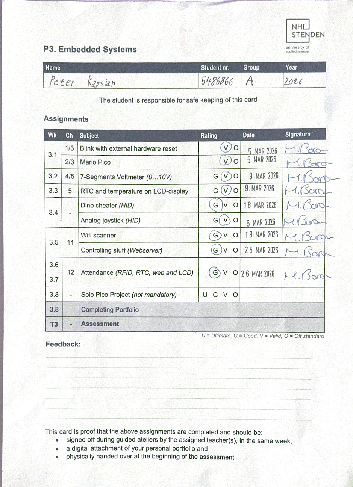

## Blink with hardware reset

### Description
This is a simple test that blinks an LED on and off. With this we can verify that the microcontroller works properly. It also displays how to use an external hardware reset button to reset the microcontroller.

The code first imports the libraries for pin controll and time functions. It defines the 
output pins for the LEDs. In this case I used one external LED and also the picos built in LED. After that it just enters in a loop where it turns the leds on and off with some delays in between.

Components used:
- 1x RPI Pico W
- 1x LED
- 1x 10KΩ resistor
- push button

### Schematic
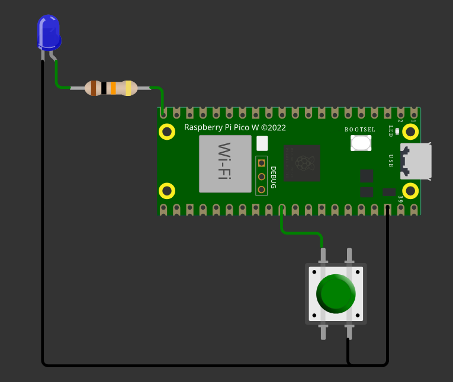

### Code
`main.py`
```python
from machine import Pin
import utime

led_builtin = Pin("LED", Pin.OUT)
led_external = Pin(15, Pin.OUT)

while True:
    led_builtin.high()
    led_external.high()
    utime.sleep_ms(200)
    
    led_builtin.low()
    led_external.low()
    utime.sleep_ms(800)
```

### Output
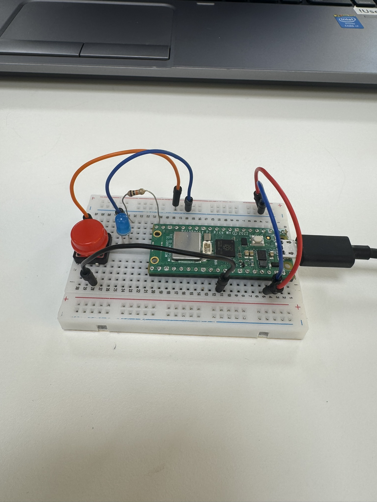

## Mario pico

### Description
A short practice program that draws a pyramid shape to the output terminal using printable characters. It defines one variable at the begining which controlls the size of the pyramid drawing. For the first pyramid I just use a single character. It starts drawing it from the top so each line will get N "#" symbols on the N-th line. The second pyramid works on the same principle but prints diffenet symbols based on if it is printing the edge of the pyramid or the middle part.

Components used:
- 1x RPI Pico W

### Schematic
Not applicable for this project since it only prints to the console.

### Code
`main.py`
```python
pyramidSize = 10

for y in range(pyramidSize):
    for x in range(pyramidSize):
        if x < pyramidSize - y - 1:
            print(" ", end="")
        else:
            print("# ", end="")
    print()

for y in range(pyramidSize):
    for x in range(pyramidSize):
        if x < pyramidSize - y - 1:
            print(" ", end="")
        else:
            if y == 0:
                print("^", end="")
            elif x == pyramidSize - y - 1:
                print("/#", end="")
            elif x == pyramidSize - 1:
                print("\\ ", end="")
            else:
                print("##", end="")
    print()

```

### Output
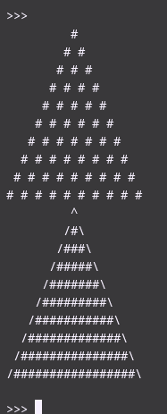

## 7-Segments Voltmeter (0..10V)

### Description
This project uses a voltage divider to measure voltages from 0 to 10V using the Pico's ADC which can only measure up to 3.3V. The voltage is then displayed on a 4-digit 7-segment display. 

In the code the rpi calculates the voltage by multiplying the ADC reading by the voltage divider ratio. The voltage is then displayed on the 4-digit 7-segment display using a custom library that I created for controlling the display.

To controll the display the code uses a technique called multiplexing. This means that it turns on one digit at a time and sets the segments for that digit. It does this very quickly so that it appears that all digits are on at the same time. This is done to reduce the number of pins needed to control the display. To turn on a digit it connects the common cathode of that digit to ground using one of the transistors. The segments are then controlled by setting the corresponding pins high or low. To streamline this process the library has a predefined list of the segment values for each digit from 0 to 9. The library also has a function to write a value to the display which takes care of the multiplexing and segment control.

Components used:
- 1x RPI Pico W
- 1x 4-digit 7-segment display
- 5x 10KΩ resistor
- 1x 4.7KΩ resistor
- 8x 220Ω resistor
- 4x BC547C transistor 

### Schematic
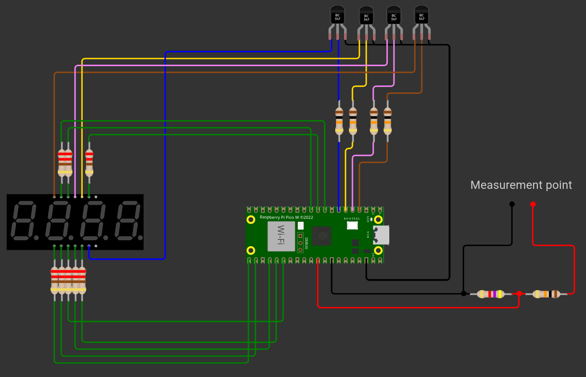

### Code
`main.py`
```python
from segment_display import Display
from machine import Pin, ADC
import time

# Display pin definitions
DISPLAY_DIGIT_1_PIN = 2
DISPLAY_DIGIT_2_PIN = 3
DISPLAY_DIGIT_3_PIN = 4
DISPLAY_DIGIT_4_PIN = 5
DISPLAY_SEGMENT_A_PIN = 6
DISPLAY_SEGMENT_B_PIN = 7
DISPLAY_SEGMENT_F_PIN = 8
DISPLAY_SEGMENT_E_PIN = 16
DISPLAY_SEGMENT_D_PIN = 17
DISPLAY_SEGMENT_C_PIN = 18
DISPLAY_SEGMENT_G_PIN = 19
DISPLAY_SEGMENT_DP_PIN = 20

# Voltmeter pin definition
VOLT_METER_PIN = 26
VOLTAGE_DIVIDER_RATIO = 3.127659574 # Calculated as (R1 + R2) / R2, where R1 = 10kΩ and R2 = 4.7kΩ

# Initialize the display
display = Display(
    DISPLAY_DIGIT_1_PIN,
    DISPLAY_DIGIT_2_PIN,
    DISPLAY_DIGIT_3_PIN,
    DISPLAY_DIGIT_4_PIN,
    DISPLAY_SEGMENT_A_PIN,
    DISPLAY_SEGMENT_B_PIN,
    DISPLAY_SEGMENT_C_PIN,
    DISPLAY_SEGMENT_D_PIN,
    DISPLAY_SEGMENT_E_PIN,
    DISPLAY_SEGMENT_F_PIN,
    DISPLAY_SEGMENT_G_PIN,
    DISPLAY_SEGMENT_DP_PIN,
)

# Initialize the voltmeter
voltmeter = ADC(Pin(VOLT_METER_PIN, Pin.IN))

# Main loop variables
update_delay_ms = 250
next_update_time = time.ticks_ms()
voltage = 0

while True:
    current_time = time.ticks_ms()

    display.write_value(voltage*100, dp=1)

    if time.ticks_diff(current_time, next_update_time) >= 0:
        voltage = (voltmeter.read_u16() / 65535) * 3.3 * VOLTAGE_DIVIDER_RATIO # Convert the ADC reading to a voltage value
        print(voltage)

        next_update_time = time.ticks_add(current_time, update_delay_ms)
```

`segment_display.py`
```python
from machine import Pin
import time

DIGITS = [
    # .GFEDCBA
    0b00111111, # 0
    0b00000110, # 1
    0b01011011, # 2
    0b01001111, # 3
    0b01100110, # 4
    0b01101101, # 5
    0b01111101, # 6
    0b00000111, # 7
    0b01111111, # 8
    0b01101111, # 9
]

class Display():
    digit_pins = []
    segment_pins = []
    digit_time_on_us = 500
    digit_time_off_us = 100
    
    def __init__(self, DIGIT_1_PIN, DIGIT_2_PIN, DIGIT_3_PIN, DIGIT_4_PIN, SEGMENT_A_PIN, SEGMENT_B_PIN, SEGMENT_C_PIN, SEGMENT_D_PIN, SEGMENT_E_PIN, SEGMENT_F_PIN, SEGMENT_G_PIN, SEGMENT_DP_PIN):
        self.digit_pins = [
            Pin(DIGIT_1_PIN, Pin.OUT),
            Pin(DIGIT_2_PIN, Pin.OUT),
            Pin(DIGIT_3_PIN, Pin.OUT),
            Pin(DIGIT_4_PIN, Pin.OUT),
        ]

        self.segment_pins = [
            Pin(SEGMENT_A_PIN, Pin.OUT),
            Pin(SEGMENT_B_PIN, Pin.OUT),
            Pin(SEGMENT_C_PIN, Pin.OUT),
            Pin(SEGMENT_D_PIN, Pin.OUT),
            Pin(SEGMENT_E_PIN, Pin.OUT),
            Pin(SEGMENT_F_PIN, Pin.OUT),
            Pin(SEGMENT_G_PIN, Pin.OUT),
            Pin(SEGMENT_DP_PIN, Pin.OUT),
        ]
        
    def write_value(self, value, dp=-1):
        # Convert the value to an integer and clamp it to the range 0-9999
        value = max(0, min(9999, value))
        value = int(value)

        for digit_index in range(4):
            dp_enable = (dp == digit_index)
            digit_value = (value // (10 ** (3 - digit_index))) % 10
            self.set_digit(digit_index, digit_value, dp=dp_enable)

    def set_digit(self, digit_index, digit_value, dp=False):
        # Set the common cathode
        for index in range(len(self.digit_pins)):
            digit_on = index == digit_index
            self.digit_pins[index].value(digit_on)

        # Set the segments for the digit
        for index in range(len(self.segment_pins)):
            segment_on = (DIGITS[digit_value] >> index) & 1
            self.segment_pins[index].value(segment_on)
        self.segment_pins[7].value(dp)

        time.sleep_us(self.digit_time_on_us)

        # Turn off all digits to reduce ghosting
        for index in range(len(self.segment_pins)):
            self.segment_pins[index].value(0)

        time.sleep_us(self.digit_time_off_us)
```

### Output
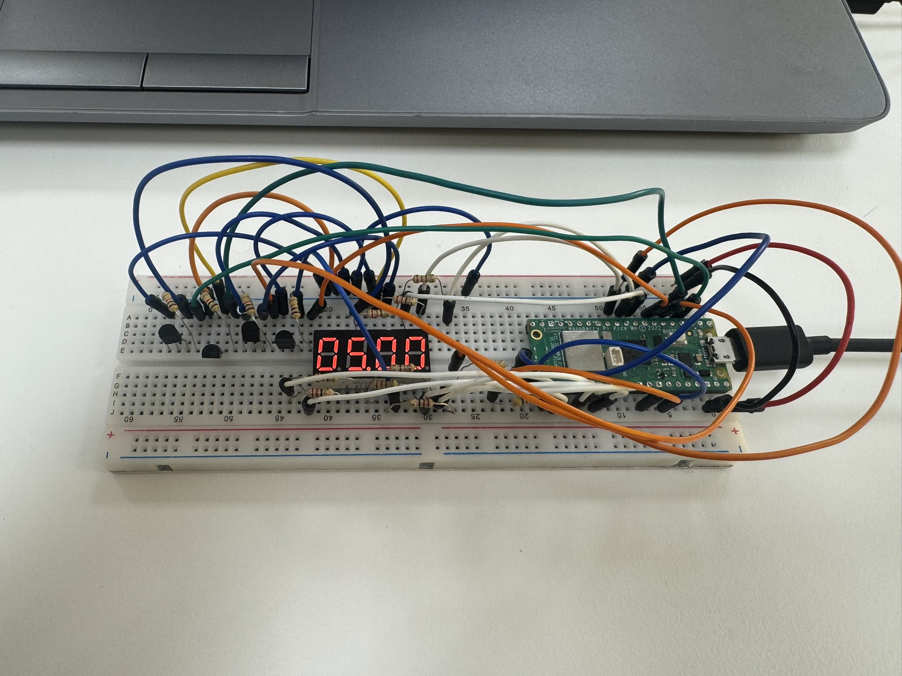

## RTC and temperature on LCD-display

### Description
This project uses a DS1302 RTC module to get the current date and time, an LM35 temperature sensor to measure the ambient temperature and it displays this information on a 16x2 I2C LCD display.

The code utilizes external libraries for the LCD display and the RTC module. It initializes the modules and then enters its main loop. Here are 3 independent timers for each component so they can update at different intervals without straining the CPU too much

Componets used:
- 1x RPI Pico W
- 1x DS1302 RTC module
- 1x LM35 temperature sensor
- 1x 16x2 I2C LCD display

### Schematic
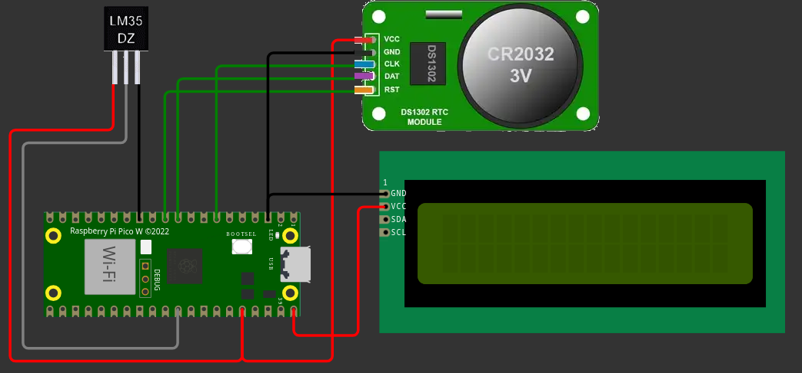

### Code
`main.py`
```python
from machine import Pin, SoftI2C, I2C, ADC
from machine_i2c_lcd import I2cLcd
import time
import ds1302

# RTC constants
RTC_CLK_PIN = 5
RTC_DAT_PIN = 7
RTC_RST_PIN = 8

# I2C LCD constants
I2C_NUM_ROWS = 2
I2C_NUM_COLS = 16

LCD_SDA_PIN = 16
LCD_SCL_PIN = 17

# RTC initialization
rtc_module = ds1302.DS1302(Pin(RTC_CLK_PIN), Pin(RTC_DAT_PIN), Pin(RTC_RST_PIN))

# LCD initialization
i2c = I2C(0, scl=Pin(LCD_SCL_PIN), sda=Pin(LCD_SDA_PIN), freq=400000)
devices = i2c.scan()

i2c_addr = None
for d in devices:
    if d in range(0x20, 0x28):  # PCF8574 I2C address range
        print(f"Setting i2c address: {hex(d)}")
        i2c_addr = d
        break

lcd = I2cLcd(i2c, i2c_addr, I2C_NUM_ROWS, I2C_NUM_COLS)
lcd.backlight_on()
lcd.hide_cursor()
lcd.clear()

# LM35 initialization
LM35 = ADC(Pin(26)) 

# set the rtc module
#rtc_module.date_time([2026, 3, 8, 7, 19, 50, 0]) # format: [year, month, day, weekday, hour, minute, second]

# Main loop variables
current_time = time.time()
tmp_read_update_interval = 3  # seconds
next_tmp_read_time = current_time # Read temp every 10 seconds

rtc_update_interval = 1  # seconds
next_rtc_update_time = current_time  # Update RTC display every second

lcd_update_interval = 0.5  # seconds
next_lcd_update_time = current_time# Update LCD every second

try:
    while True:
        current_time = time.time()

        # Get data from temp sensor
        if current_time >= next_tmp_read_time:
            LM35raw = LM35.read_u16()
            LM35temp = (LM35raw / 65535) * 3.3 * 100  # Convert to Celsius

            next_tmp_read_time = current_time + tmp_read_update_interval 

        # Get data from DS1302 RTC
        if current_time >= next_rtc_update_time:
            date_time = rtc_module.date_time()

            next_rtc_update_time = current_time + rtc_update_interval

        # Debug print
        # if date_time is not None:
        #     print(f"Current Date and Time: {date_time[2]:02d}.{date_time[1]:02d}.{date_time[0]:04d} {date_time[4]:02d}:{date_time[5]:02d}:{date_time[6]:02d}")
        # else:
        #     print("Current Date and Time: unavailable")

        # Display on LCD
        if current_time >= next_lcd_update_time:
            if date_time is not None:
                lcd.move_to(0, 0)
                lcd.putstr(f"{date_time[2]:02d}.{date_time[1]:02d}.  {date_time[4]:02d}:{date_time[5]:02d}:{date_time[6]:02d}")
            
            lcd.move_to(0, 1)
            lcd.putstr(f"Temp: {LM35temp:02.1f}C")

            next_lcd_update_time = current_time + lcd_update_interval

except KeyboardInterrupt:
    print("Exiting program.")
    lcd.backlight_off()
```
#### External libraries used:
- LCD API library: https://github.com/dhylands/python_lcd/blob/master/lcd/lcd_api.py
- Machine I2C LCD library: https://github.com/dhylands/python_lcd/blob/master/lcd/machine_i2c_lcd.py
- ds1302 Real Time Clock library: https://github.com/omarbenhamid/micropython-ds1302-rtc/blob/master/ds1302.py

### Output
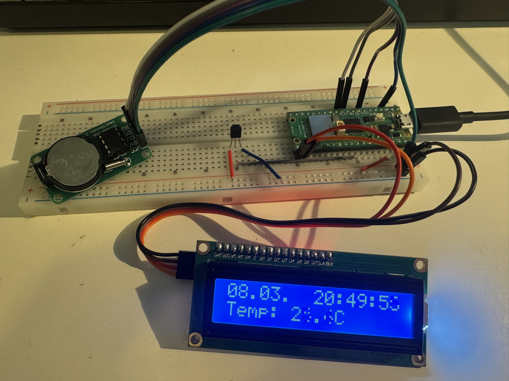 

## Dino cheater (HID)

### Description
the Dino cheater project aims to automate the Chrome Dino game using a raspberry to emulate keyboard inputs. To achieve this the contraption has 2 photoresistors that read the screen brightness which can tell the microcontroller if there is an obstacle approaching. I also included a push button that can be used to enable or disable the cheater without having to unplug the device. Achieving a consistent performance with this setup can be quite tricky and might give you varying results based on your displays brightness refresh rate or even ambient light. 

To achieve this in the code i implemented a calibration method which runs initially before the main loop. It takes multiple readings of the photoresistors and based on the highest and lowest observed values it can determine roughly where is the threshold between the background and the obstacles. During the calibration you are expected to expose both photoresistors to the background and the obstacles so it can get a good range of values to work with. After the calibration is done the code enters the main loop where it continuously reads the photoresistors and sends a jump/duck key if it detects an obstacle. To further improve consistency the code also has a short buffer of readings so it doesn't send missinputs in case of a sudden spike. I recommend to keep this buffer short because it can slow reaction time or miss obstacles completely if they don't contribute to the average enough. 

Components used:
- 1x RPI Pico W
- 2x photoresistor
- 2x 220Ω resistor
- 1x 10KΩ resistor
- 1x push button

### Schematic
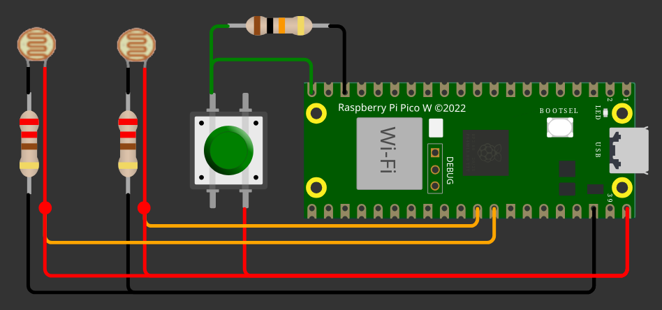

### Code
`main.py`
```python
# Circuit python
import time
import board
import analogio
import digitalio
import usb_hid
from adafruit_hid.keyboard import Keyboard
from adafruit_hid.keycode import Keycode

BUTTON_PIN = board.GP15
BUILTIN_LED_PIN = board.LED
TOP_PHOTORESISTOR_PIN = board.GP27
BOT_PHOTORESISTOR_PIN = board.GP28

# TOP_BLACK_TRESHHOLD = 2000
# BOT_BLACK_TRESHHOLD = 3000

SENSOR_HISTORY_SIZE = 5
CALIBRATION_SAMPLES = 500
CALIBRATION_SAMPLE_DELAY = 0.01
BLACK_THRESHOLD_FACTOR = 0.35 # 0-1, more = sooner trigger

JUMP_KEY = Keycode.UP_ARROW
DUCK_KEY = Keycode.DOWN_ARROW

# Initialize the devices
button_pin = digitalio.DigitalInOut(BUTTON_PIN)
button_pin.direction = digitalio.Direction.INPUT

built_in_led = digitalio.DigitalInOut(BUILTIN_LED_PIN)
built_in_led.direction = digitalio.Direction.OUTPUT

top_photoresistor = analogio.AnalogIn(TOP_PHOTORESISTOR_PIN)
bot_photoresistor = analogio.AnalogIn(BOT_PHOTORESISTOR_PIN)   

# Initialize the keyboard
kbd = Keyboard(usb_hid.devices)

game_started = False
built_in_led.value = False

top_sensor_history = []
bot_sensor_history = []


def calibrate_photoresistors(sample_count=CALIBRATION_SAMPLES, sample_delay=CALIBRATION_SAMPLE_DELAY):
    top_max = 0
    top_min = 65535
    bot_max = 0
    bot_min = 65535

    print("Calibrating sensors...")
    built_in_led.value = True
    for _ in range(sample_count):
        if(top_photoresistor.value > top_max):
            top_max = top_photoresistor.value
        if(top_photoresistor.value < top_min):
            top_min = top_photoresistor.value
        if(bot_photoresistor.value > bot_max):
            bot_max = bot_photoresistor.value
        if(bot_photoresistor.value < bot_min):
            bot_min = bot_photoresistor.value
        time.sleep(sample_delay)
    built_in_led.value = False

    top_diff = top_max - top_min
    bot_diff = bot_max - bot_min

    top_threshold = top_min + (top_diff * BLACK_THRESHOLD_FACTOR)
    bot_threshold = bot_min + (bot_diff * BLACK_THRESHOLD_FACTOR)

    return top_threshold, bot_threshold


TOP_BLACK_TRESHHOLD, BOT_BLACK_TRESHHOLD = calibrate_photoresistors()

while True:
    top_value = top_photoresistor.value
    bot_value = bot_photoresistor.value

    top_sensor_history.append(top_value)
    if len(top_sensor_history) > SENSOR_HISTORY_SIZE:
        top_sensor_history.pop(0)

    bot_sensor_history.append(bot_value)
    if len(bot_sensor_history) > SENSOR_HISTORY_SIZE:
        bot_sensor_history.pop(0)
    
    top_average = sum(top_sensor_history) / len(top_sensor_history)
    bot_average = sum(bot_sensor_history) / len(bot_sensor_history)

    print(f"Top AVG: {top_average} Bot AVG: {bot_average}  | Top_tresh: {TOP_BLACK_TRESHHOLD} Bot_tresh: {BOT_BLACK_TRESHHOLD}") 

    button_value = bool(button_pin.value)
    if(button_value):
        print("Starting game")
        game_started = not game_started
        built_in_led.value = game_started
        if game_started:
            kbd.press(JUMP_KEY)
            kbd.release(JUMP_KEY)
            kbd.press(DUCK_KEY)
            kbd.release(DUCK_KEY)
        else:
            kbd.release(JUMP_KEY)
            kbd.release(DUCK_KEY)
        time.sleep(1)

    if(game_started):
        # Avoid cactus
        if(bot_average < BOT_BLACK_TRESHHOLD):
            print("Jump")
            kbd.press(JUMP_KEY)
            built_in_led.value = False
            time.sleep(0.25)
            kbd.release(JUMP_KEY)
            kbd.press(DUCK_KEY)
            time.sleep(0.075)
            kbd.release(DUCK_KEY)
            built_in_led.value = True
        
        # Avoid flying bird
        if(top_average < TOP_BLACK_TRESHHOLD and bot_average > BOT_BLACK_TRESHHOLD):
            print("Duck")
            kbd.press(DUCK_KEY)
            built_in_led.value = False
            time.sleep(0.6)
            kbd.release(DUCK_KEY)
            built_in_led.value = True
```

#### External libraries used:
- Adafruit HID keyboard library: https://github.com/adafruit/Adafruit_CircuitPython_HID/blob/main/adafruit_hid/keyboard.py
- Adafruit HID keycode library: https://github.com/adafruit/Adafruit_CircuitPython_HID/blob/main/adafruit_hid/keycode.py

### Output
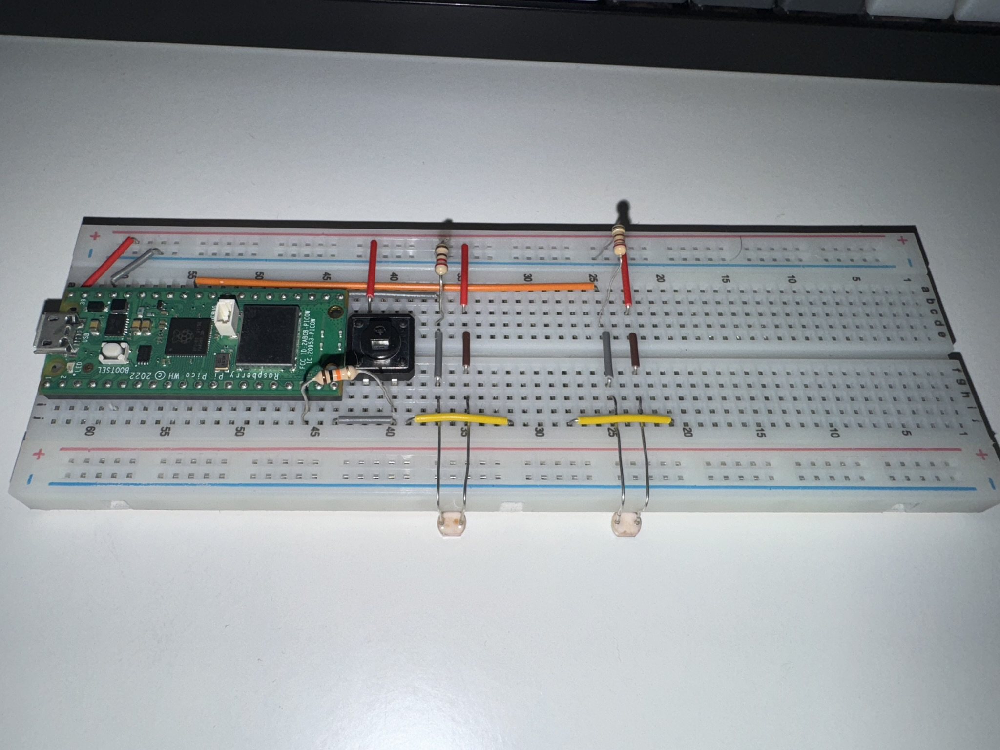

## Analog joystick (HID)

### Description
This project makes the Rpi pico act as a HID keyboard that is controlled by a 2-axis analog joystick and a push button. This setup can be used to play simple games like tertis or super mario bros by mapping the joystick movements to the arrow keys. 

The code relies on the Adafruit HID library to send keyboard inputs to the PC. It reads the values from the joystick and the button and based on that it sends the corresponding key presses. The joystick has a deadzone to prevent random missinputs when the joystick is near the center position. 

Components used:
- 1x RPI Pico W
- 1x 2-axis analog joystick
- 1x 10kΩ resistor
- 1x push button

### Schematic
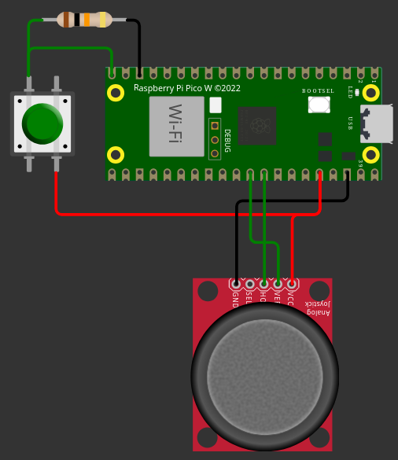

### Code
`main.py`
```python
import time
import board
import analogio
import digitalio
import usb_hid
from adafruit_hid.keyboard import Keyboard
from adafruit_hid.keycode import Keycode

JOYSTICK_DEADZONE_PERCENT = 10  # Deadzone for joystick input. Goes both ways so 5$ means from 45 to 55 is deadzone

# Define the pins for the input devices
x_pin = analogio.AnalogIn(board.GP26)  # A0
y_pin = analogio.AnalogIn(board.GP27)  # A1

button_pin = digitalio.DigitalInOut(board.GP15)
button_pin.direction = digitalio.Direction.INPUT

# Init keyboard object for sending input to PC
kbd = Keyboard(usb_hid.devices)

button_pressed = False
left_pressed = False
right_pressed = False
up_pressed = False
down_pressed = False

while True:
    # Read the input values
    x_value = (x_pin.value / 65535) * 100  # Scale to 0-100
    y_value = (y_pin.value / 65535) * 100  # Scale to 0-100
    button_value = bool(button_pin.value)

    # Print the joystick values for debug
    # print("X: {:.2f} Y:{:.2f} Button: {}".format(x_value, y_value, button_value))

    #determine actions
    move_left = x_value < (50 - JOYSTICK_DEADZONE_PERCENT)
    move_right = x_value > (50 + JOYSTICK_DEADZONE_PERCENT)
    move_up = y_value < (50 - JOYSTICK_DEADZONE_PERCENT)
    move_down = y_value > (50 + JOYSTICK_DEADZONE_PERCENT)
    
    if(button_value != button_pressed):
        button_pressed = button_value
        if button_pressed:
            kbd.press(Keycode.SPACE)
        else:
            kbd.release(Keycode.SPACE)

    # Joystick movement x-axis
    if move_left != left_pressed:
        left_pressed = move_left
        if left_pressed:
            kbd.press(Keycode.LEFT_ARROW)
        else:
            kbd.release(Keycode.LEFT_ARROW)

    if move_right != right_pressed:
        right_pressed = move_right
        if right_pressed:
            kbd.press(Keycode.RIGHT_ARROW)
        else:
            kbd.release(Keycode.RIGHT_ARROW)

    # Joystick movement y-axis
    if move_up != up_pressed:
        up_pressed = move_up
        if up_pressed:
            kbd.press(Keycode.UP_ARROW)
        else:
            kbd.release(Keycode.UP_ARROW)

    if move_down != down_pressed:
        down_pressed = move_down
        if down_pressed:
            kbd.press(Keycode.DOWN_ARROW)
        else:
            kbd.release(Keycode.DOWN_ARROW)

    time.sleep(0.01)  # Small delay to prevent excessive CPU usage
```

#### External libraries used:
- Adafruit HID keyboard library: https://github.com/adafruit/Adafruit_CircuitPython_HID/blob/main/adafruit_hid/keyboard.py
- Adafruit HID keycode library: https://github.com/adafruit/Adafruit_CircuitPython_HID/blob/main/adafruit_hid/keycode.py

### Output
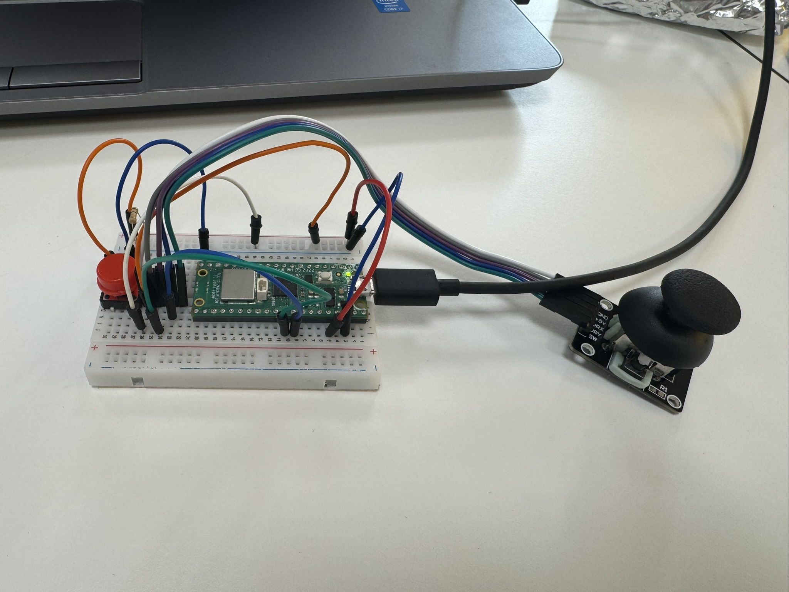

## WiFi scanner

### Description
This project utilizes the WiFi capabilities of the RPI Pico W to scan for nearby WiFi access points and display them on a web interface. 

The pico first connects to a WiFi network using the credentials provided in the `secrets.py` file so it can serve the web interface. If you are recreating this project you need to create your own `secrets.py` file based on the `secrets.py.example` file with your own credentials. The web server listens for incoming HTTP requests and serves the `index.html` page when the root end point is called. The page itself that periodically makes requests to the `/scan` endpoint back from the pico. Calling this endpoint triggers a WiFi scan on the pico which returns a list of nearby WiFi networks sorted by signal strength. The web page then displays this list in a table format.

Components used:
- 1x RPI Pico W

### Schematic
Not applicable for this project - its only the standalone pico w

### Code
`main.py`
```python
import time
import network
import socket
try:
    import ujson as json
except ImportError:
    import json
from secrets import SSID, PASSWORD

# enable station interface and connect to WiFi access point
nic = network.WLAN(network.WLAN.IF_STA)
nic.active(True)

# Connect to WiFi (if not already connected)
if not nic.isconnected():
    print('Connecting to WiFi...')
    nic.connect(SSID, PASSWORD)
    # wait for connection (timeout after ~15 seconds)
    timeout = 15
    while not nic.isconnected() and timeout > 0:
        time.sleep(1)
        timeout -= 1

if nic.isconnected():
    print('Connected, network config:', nic.ifconfig())
else:
    print('Failed to connect to WiFi. Check SSID/PASSWORD')

# create a TCP socket for the web server
s = socket.socket(socket.AF_INET, socket.SOCK_STREAM)
s.bind(('', 80))
s.listen(5)


def send_response(conn, status, content_type, body):
    conn.send(('HTTP/1.1 {}\r\n'.format(status)).encode())
    conn.send(('Content-Type: {}\r\n'.format(content_type)).encode())
    conn.send('Connection: close\r\n\r\n'.encode())
    conn.send(body.encode())


def scan_networks_payload(nic):
    networks = nic.scan()
    networks.sort(key=lambda x: x[3], reverse=True)  # sort by RSSI (signal strength)

    rows = []
    for index, net in enumerate(networks, start=1):
        ssid = net[0].decode('utf-8') if isinstance(net[0], bytes) else str(net[0])
        if not ssid:
            ssid = '(hidden)'
        rows.append({'nr': index, 'ssid': ssid, 'rssi': net[3]})

    return json.dumps({'ok': True, 'networks': rows})


def load_index_html():
    try:
        with open('index.html', 'r') as f:
            return f.read()
    except Exception as e:
        return '<h1>index.html missing</h1><p>{}</p>'.format(e)

while True:
    conn, addr = s.accept()
    request_raw = conn.recv(1024)
    request_line = request_raw.decode('utf-8', 'ignore').split('\r\n')[0]
    request_parts = request_line.split(' ')
    path = request_parts[1] if len(request_parts) > 1 else '/'

    if path == '/':
        html = load_index_html()
        send_response(conn, '200 OK', 'text/html', html)
    elif path.startswith('/scan'):
        try:
            payload = scan_networks_payload(nic)
            send_response(conn, '200 OK', 'application/json', payload)
        except Exception as e:
            error_payload = json.dumps({'ok': False, 'error': str(e), 'networks': []})
            send_response(conn, '500 Internal Server Error', 'application/json', error_payload)
    else:
        send_response(conn, '404 Not Found', 'text/plain', 'Not Found')

    conn.close()
    # (optional) small delay to give the WiFi chip a breather
    time.sleep(1)
```

`secrets.py.example`
```python
# WiFi credentials 
SSID = "YOUR_NET_SSID"
PASSWORD = "YOUR_NET_PASS"
```

`index.html`
```html
<!DOCTYPE html>
<html lang="en">
<head>
    <meta charset="UTF-8">
    <meta name="viewport" content="width=device-width, initial-scale=1.0">
    <title>WiFi Scanner</title>
    <style>
      table, th, td {
        border: 1px solid black;
        border-collapse: collapse;
        padding: 5px;
      }
    </style>
</head>
<body>
  <h1>Available WiFi Networks</h1>
  <table>
    <thead>
      <tr><th>Nr</th><th>SSID</th><th>RSSI</th></tr>
    </thead>
    <tbody id="rows"></tbody>
  </table>

  <script>
    async function refreshScan() {
      const rows = document.getElementById('rows');

      try {
        const response = await fetch('/scan');
        const data = await response.json();

        if (!data.ok) {
            return;
        }
        
        rows.innerHTML = '';

        ac_points = data.networks
        for (let i = 0; i < ac_points.length; i++) {
            const ap = ac_points[i];
            const row = document.createElement('tr');
            row.innerHTML = `<td>${ap.nr}</td><td>${ap.ssid}</td><td>${ap.rssi} dBm</td>`;
            rows.appendChild(row);
        }

      } catch (err) {
            return;
        }
    }

    refreshScan();
    setInterval(refreshScan, 10000);
  </script>
</body>
</html>
```

### Output
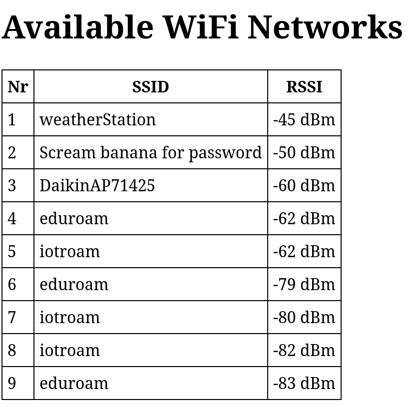

## Controlling stuff (Webserver)

### Description
This project creates a simple web interface to control a physical component and retrieve sensor over the web using the RPI Pico W. 

This project features a wrapper library for the web server related stuff to keep the main code clean and focused on the hardware control logic. The library can handle conecting to a wifi network and serving responses either as json or by serving files.

The server has 3 endpoints: the root endpoint which serves the `index.html` file, via the web interface we can then call the `/hardwareState` endpoint to get the current state of the button and the internal temperature sensor and we can call the `/toggleLED` endpoint to toggle the state of the LED. 

Components used:
- 1x RPI Pico W
- 1x push button
- 1x LED
- 2x 10kΩ resistor

### Schematic
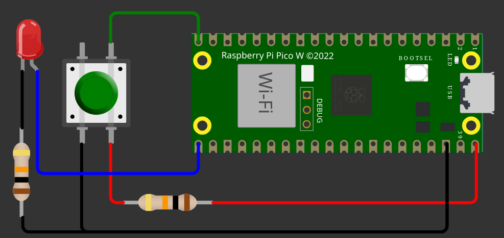

### Code
`main.py`
```python
from machine import Pin, ADC
import socket
from web_server import connect_wifi, send_json, serve_file

BUTTON_PIN = 15
LED_PIN = 16

button_pin = Pin(BUTTON_PIN, Pin.IN)
led_pin = Pin(LED_PIN, Pin.OUT)
temp_sensor = ADC(4)

# Connect to WiFi
connect_wifi()

# create a TCP socket for the web server
s = socket.socket(socket.AF_INET, socket.SOCK_STREAM)
s.bind(('', 80))
s.listen(5)

def read_internal_temperature():
    # Read the raw ADC value
    adc_value = temp_sensor.read_u16()

    # Convert ADC value to voltage
    voltage = adc_value * (3.3 / 65535.0)

    # Temperature calculation based on sensor characteristics
    temperature_celsius = 27 - (voltage - 0.706) / 0.001721

    return temperature_celsius

while True:
    conn, addr = s.accept()
    print('Client connected from', addr)
    request = conn.recv(1024).decode()
    print('Request:', request)

    if 'GET / ' in request:
        serve_file(conn, 'index.html')
    elif 'GET /hardwareState' in request:
        send_json(conn, '200 OK', {
            'buttonState': not button_pin.value(),
            'cpuTemp': read_internal_temperature(),
        })
    elif 'GET /toggleLED' in request:
        led_pin.value(0 if led_pin.value() else 1)
        send_json(conn, '200 OK', {
            'ledState': led_pin.value(),
        })
    else:
        send_json(conn, '404 Not Found', {
            'error': 'Route not found',
        })
    
    conn.close()
```

`secrets.example.py`
```python
# WiFi credentials 
SSID = "YOUR_NET_SSID"
PASSWORD = "YOUR_NET_PASS"
```

`web_server.py`
```python
try:
    import ujson as json
except ImportError:
    import json

import time
import network
from secrets import SSID, PASSWORD


def connect_wifi(timeout=15):
    """Connect to WiFi network. Returns True if connected, False otherwise."""
    nic = network.WLAN(network.WLAN.IF_STA)
    nic.active(True)

    if not nic.isconnected():
        print('Connecting to WiFi...')
        nic.connect(SSID, PASSWORD)
        # wait for connection (timeout after ~15 seconds)
        while not nic.isconnected() and timeout > 0:
            time.sleep(1)
            timeout -= 1

    if nic.isconnected():
        print('Connected, network config:', nic.ifconfig())
        return True
    else:
        print('Failed to connect to WiFi. Check SSID/PASSWORD')
        return False


def send_response(conn, status, content_type, body):
    conn.send(('HTTP/1.1 {}\r\n'.format(status)).encode())
    conn.send(('Content-Type: {}\r\n'.format(content_type)).encode())
    conn.send('Connection: close\r\n\r\n'.encode())
    conn.send(body.encode())


def send_json(conn, status, payload):
    send_response(conn, status, 'application/json', json.dumps(payload))


def serve_file(conn, filepath, status='200 OK', content_type='text/html'):
    """Serve a file from the filesystem."""
    try:
        with open(filepath, 'r') as f:
            body = f.read()
        send_response(conn, status, content_type, body)
        return True
    except OSError:
        return False
```

`index.html`
```html
<!DOCTYPE html>
<html>
<head>
    <title>Button & LED Control</title>
</head>
<body>
    <h1>Button & LED Control</h1>
    
    <p>Button Status: <strong id="buttonStatus">Loading...</strong></p>
    <p>CPU Temperature: <strong id="cpuTemp">Loading...</strong> &deg;C</p>
    
    <button onclick="toggleLED()">Toggle LED</button>
    
    <script>
        async function updateStatus() {
            try {
                const response = await fetch('/hardwareState');
                const data = await response.json();
                document.getElementById('buttonStatus').textContent = data.buttonState ? 'Pressed' : 'Not Pressed';
                document.getElementById('cpuTemp').textContent = data.cpuTemp.toFixed(2);
            } catch (error) {
                console.error('Error:', error);
            }
        }
        
        async function toggleLED() {
            try {
                const response = await fetch('/toggleLED');
                const data = await response.json();
            } catch (error) {
                console.error('Error:', error);
            }
        }
        
        // Update status on page load and every 1000ms
        updateStatus();
        setInterval(updateStatus, 1000);
    </script>
</body>
</html>
```

### Output
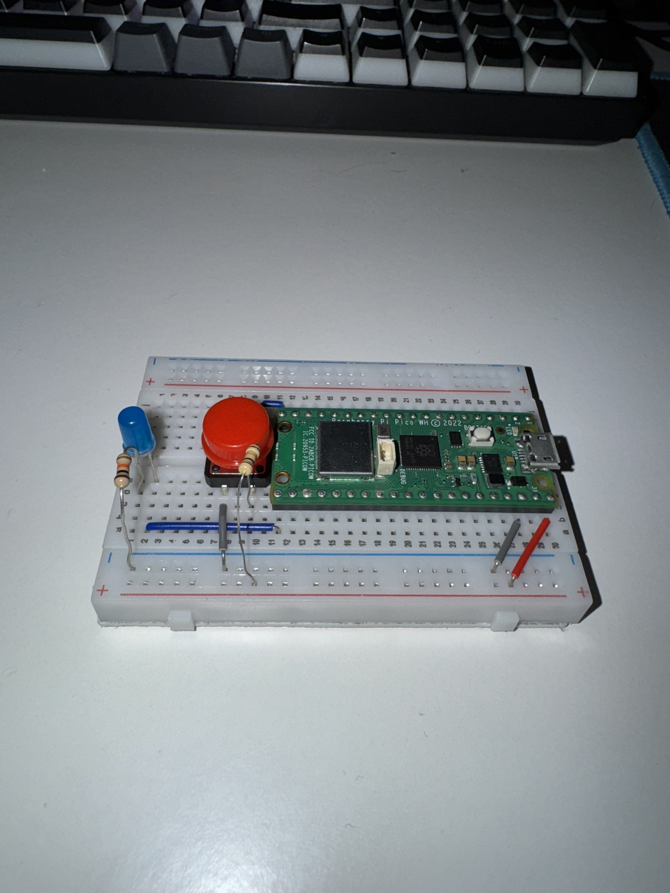
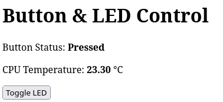

## Attendance (RFID, RTC, web and LCD)

### Description
This project is suposed to act as a simple attendance tracker system. It uses an RC522 RFID reader to read RFID cards, a DS1302 RTC module to keep track of time, a simple buzzer and an RGB LED module to indicate attendance status, and a 16x2 I2C LCD display to show the current date and time and a web interface to register new cards and see the attendance logs.

In an attempt to keep the `main.py` file clean I abstracted as much logic as possible into separate modules, this includes simple stuff like the RGB_LED module or the buzzer module and also more complex stuff like the databese handler or the web server. The main loop has 4 main functions: 3 of these are independent timers each of which update the LDC display, read the RFID reader and update the RTC time at different intervals. The 4th main function is listen for incoming HTTP requests and handle them accordingly.

The whole system is built around the web interface which can be acessed at the root endpoint. From the intercace you can register new cards by providing a name and scanning a card within a certain time window. After this you can request the attendance logs and a list of registered cards. For debug purposes I also implemented an endpoint which will clear the whole database. You probably wouldnt want this in a production environment.

The `attendance_db.py` while having database in the name is actually just a simple wrapper around a json file that acts as a database. It handles 2 main entities: the registered cards and the attendance logs.

Components used:
- 1x RPI Pico W
- 1x RC522 RFID reader
- 1x DS1302 RTC module
- 1x 16x2 I2C LCD display
- 1x buzzer
- 1x RGB LED module (module just adds 3x resistors for convenience)

### Schematic
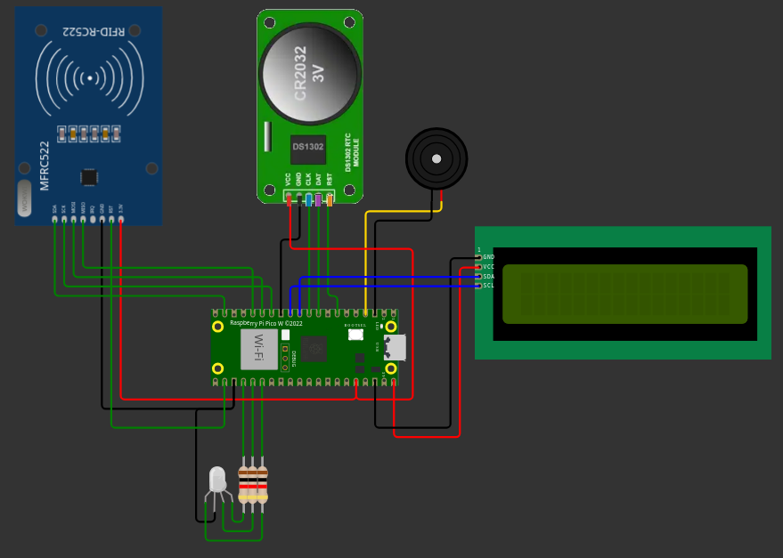

### Code
`main.py`
```python
# Micropython code

from rgb_led import RgbLed
from machine import Pin, I2C
import ds1302
import buzzer as Buzzer
import machine_i2c_lcd
from mfrc522 import MFRC522
from attendance_db import AttendanceDB
from web_server import connect_wifi, send_json, serve_file
import socket
import time
import json

# Pin definitions
BUZZER_PIN = 2
RTC_RST_PIN = 5
RTC_DAT_PIN = 6
RTC_CLK_PIN = 7
LCD_SDA_PIN = 8
LCD_SCL_PIN = 9
RFID_READER_SDA_PIN = 14
RFID_READER_SCK_PIN = 10
RFID_READER_MOSI_PIN = 11
RFID_READER_MISO_PIN = 12
RFID_READER_RST_PIN = 17
LED_B_PIN = 18
LED_G_PIN = 19
LED_R_PIN = 20

SET_RTC_ON_BOOT = False
REGISTER_TIME_WINDOW_SECONDS = 30
RFID_POLL_INTERVAL_MILLIS = 100
TIME_UPDATE_INTERVAL_MILLIS = 250
LCD_UPDATE_INTERVAL_MILLIS = 250

# Initialize peripherals
# RGB LED initialization
rgb_led = RgbLed(LED_R_PIN, LED_G_PIN, LED_B_PIN)

# RTC initialization
rtc = ds1302.DS1302(
	Pin(RTC_CLK_PIN),
	Pin(RTC_DAT_PIN),
	Pin(RTC_RST_PIN)
)

if SET_RTC_ON_BOOT:
	rtc.date_time([2026, 3, 20, 5, 19, 6, 0])
	rtc.start()

# Buzzer initialization
buzzer = Buzzer.Buzzer(Pin(BUZZER_PIN))

# LCD initialization
i2c = I2C(0, sda=Pin(LCD_SDA_PIN), scl=Pin(LCD_SCL_PIN), freq=400000)
devices = i2c.scan()
lcd_addr = machine_i2c_lcd.DEFAULT_I2C_ADDR
if devices and lcd_addr not in devices:
	lcd_addr = devices[0]

lcd = machine_i2c_lcd.I2cLcd(i2c, lcd_addr, 2, 16)
lcd.clear()
lcd.putstr("LCD ready")

# RFID reader initialization
rfid = MFRC522(
	sck=Pin(RFID_READER_SCK_PIN),
	mosi=Pin(RFID_READER_MOSI_PIN),
	miso=Pin(RFID_READER_MISO_PIN),
	rst=Pin(RFID_READER_RST_PIN),
	cs=Pin(RFID_READER_SDA_PIN),
	spi_id=1
)

# Attendance database initialization
attendance_db = AttendanceDB()

# Configure WiFi and start web server
connect_wifi()
s = socket.socket(socket.AF_INET, socket.SOCK_STREAM)
s.bind(('', 80))
s.listen(5)
s.settimeout(0.2) # Important - socket will block execution otherwise


# Helper functions
def uid_to_key(uid):
	"""Convert UID list/bytes/string into a stable dict key."""
	if isinstance(uid, (list, tuple)):
		# Example: [4, 163, 27, 44] -> "04A31B2C"
		return ''.join('{:02X}'.format(x) for x in uid)
	return str(uid)


def readRfidCard():
	"""Read an RFID card and return its UID as a string key, or None if no card is present."""
	stat, bits = rfid.request(rfid.REQIDL)
	if stat == rfid.OK:
		stat, uid = rfid.SelectTagSN()
		if stat == rfid.OK:
			return uid_to_key(uid)
	return None

def readRfidCardForTime(time_window_seconds):
	"""Attempt to read an RFID card for a specified time window."""
	start_time = time.time()
	while time.time() - start_time < time_window_seconds:
		uid = readRfidCard()
		if uid is not None:
			return uid
		time.sleep_ms(RFID_POLL_INTERVAL_MILLIS)
			
	# No card detected within the time window
	return None


def registerCard(name): 
	"""Register a new card to the database with the given name. Returns True on success, False on failure."""
	rgb_led.set_color(False, False, True)  # Blue for registration mode
	if name is None or name.strip() == "":
		rgb_led.blink_color(True, False, False)  # Red for error
		return False
	
	name = name.strip() 
	uid = readRfidCardForTime(REGISTER_TIME_WINDOW_SECONDS)
	
	if uid is  None:
		rgb_led.blink_color(True, False, False)  # Red for error
		return False
	
	attendance_db.register_card(uid=uid, name=name)
	
	rgb_led.blink_color(False, True, False)  # Green for success
	return True


def checkIn(uid, timestamp):
	"""Check in or out a card with the given UID and timestamp. Returns (success, message)."""
	success, message = attendance_db.check_in(uid, timestamp)
	if success:
		name = attendance_db.load_json_file(attendance_db.known_cards_filename).get(uid, "Unknown")
		if(message == "Checked in"):
			rgb_led.set_color(False, True, False)  # Green for success
			write_to_lcd("Welcome", line=0)
			write_to_lcd("{}".format(name), line=1)
			buzzer.play_rising_tone()
			rgb_led.off()
		elif(message == "Checked out"):
			rgb_led.set_color(True, True, False)  # Yellow for check-out
			write_to_lcd("Goodbye", line=0)
			write_to_lcd("{}".format(name), line=1)
			buzzer.play_falling_tone()
			rgb_led.off()
	else:
		if message == "Card not registered":
			rgb_led.set_color(True, False, False)
			write_to_lcd("Unknown card", line=0)
			buzzer.play_error_tone()
			rgb_led.off()
		elif message == "Already checked in and out for today":
			rgb_led.set_color(True, False, False)  # Red for already checked in/out
			write_to_lcd("Already out", line=0)
			buzzer.play_error_tone()
			rgb_led.off()
	
	time.sleep(2)  # Keep message on LCD for a moment before clearing
	return success, message


def write_to_lcd(message, line=0):
	"""Helper function to write a message to the LCD on a specific line (0 or 1)."""
	lcd.move_to(0, line)
	text = str(message)
	if len(text) < 16:
		text = text + (" " * (16 - len(text)))
	else:
		text = text[:16]
	lcd.putstr(text)


# Main loop setup
next_time_update = time.ticks_ms() + TIME_UPDATE_INTERVAL_MILLIS
next_lcd_update = time.ticks_ms() + LCD_UPDATE_INTERVAL_MILLIS
next_rfid_read = time.ticks_ms() + RFID_POLL_INTERVAL_MILLIS
now = None

# Main loop
while True:
	# Update time from RTC
	if time.ticks_ms() >= next_time_update:
		now = rtc.date_time()
		next_time_update = time.ticks_ms() + TIME_UPDATE_INTERVAL_MILLIS
	
	# Update LCD with current info
	if time.ticks_ms() >= next_lcd_update:
		write_to_lcd("Please scan card", line=0)

		if now is not None:
			y, m, d, w, hh, mm, ss = now
			write_to_lcd("{:02d}:{:02d}:{:02d} | {:02d}.{:02d}".format(hh, mm, ss, d, m), line=1)	
		else:
			write_to_lcd("No RTC data", line=1)

		next_lcd_update = time.ticks_ms() + LCD_UPDATE_INTERVAL_MILLIS

	# Read RFID card and check in/out
	if time.ticks_ms() >= next_rfid_read:
		uid = readRfidCard()
		if uid is not None and now is not None:
			success, message = checkIn(uid, now)
			print("Card UID: {}, Result: {}, Message: {}".format(uid, success, message))
		
		next_rfid_read = time.ticks_ms() + RFID_POLL_INTERVAL_MILLIS

	# Handle web server requests without blocking periodic tasks.
	try:
		conn, addr = s.accept()
	except OSError:
		conn = None

	if conn is not None:
		try:
			request = conn.recv(1024).decode()
			header_end = request.find('\r\n\r\n')
			body = request[header_end + 4:].strip() if header_end != -1 else ""
			json_payload = json.loads(body) if body else {}

			# server index.html for root route
			if 'GET / ' in request:
				serve_file(conn, 'index.html')
			
			# Get attendance records route
			elif 'GET /attendanceRecords' in request:
				todays_records = attendance_db.get_attendance_records_by_day(now)
				send_json(conn, '200 OK', todays_records)

			# New card registration request route
			elif 'POST /registerCard' in request:
				name = json_payload.get('name')
				if name is None or name.strip() == "":
					send_json(conn, '400 Bad Request', {
						'error': 'Name is required to register a card',
					})
				elif registerCard(name):
					send_json(conn, '200 OK', {
						'message': 'Card registered successfully',
					})
				else:
					send_json(conn, '400 Bad Request', {
						'error': 'Failed to register card',
					})
			
			# Registered cards retrieval route
			elif 'GET /registeredCards' in request:
				known_cards = attendance_db.load_json_file(attendance_db.known_cards_filename)
				send_json(conn, '200 OK', known_cards)
			
			elif 'POST /clearDatabase' in request:
				attendance_db.clear_db()
				send_json(conn, '200 OK', {
					'message': 'Database cleared successfully',
				})
				rgb_led.blink_color(True, True, True, delay_ms=1000)  # White blink to indicate DB cleared

			else:
				send_json(conn, '404 Not Found', {
					'error': 'Route not found',
				})
		except Exception:
			pass
		finally:
			conn.close()
```

`web_server.py`
```python
try:
    import ujson as json
except ImportError:
    import json

import time
import network
from secrets import SSID, PASSWORD


def connect_wifi(timeout=15):
    """Connect to WiFi network. Returns True if connected, False otherwise."""
    nic = network.WLAN(network.WLAN.IF_STA)
    nic.active(True)

    if not nic.isconnected():
        print('Connecting to WiFi...')
        nic.connect(SSID, PASSWORD)
        # wait for connection (timeout after ~15 seconds)
        while not nic.isconnected() and timeout > 0:
            time.sleep(1)
            timeout -= 1

    if nic.isconnected():
        print('Connected, network config:', nic.ifconfig())
        return True
    else:
        print('Failed to connect to WiFi. Check SSID/PASSWORD')
        return False


def send_response(conn, status, content_type, body):
    conn.send(('HTTP/1.1 {}\r\n'.format(status)).encode())
    conn.send(('Content-Type: {}\r\n'.format(content_type)).encode())
    conn.send('Connection: close\r\n\r\n'.encode())
    conn.send(body.encode())


def send_json(conn, status, payload):
    send_response(conn, status, 'application/json', json.dumps(payload))


def serve_file(conn, filepath, status='200 OK', content_type='text/html'):
    """Serve a file from the filesystem."""
    try:
        with open(filepath, 'r') as f:
            body = f.read()
        send_response(conn, status, content_type, body)
        return True
    except OSError:
        return False
```

`secrets.example.py`
```python
# WiFi credentials 
SSID = "YOUR_NET_SSID"
PASSWORD = "YOUR_NET_PASS"
```

`index.html`
```html
<!DOCTYPE html>
<html lang="en">
<head>
    <meta charset="UTF-8">
    <meta name="viewport" content="width=device-width, initial-scale=1.0">
    <title>Attendance tracker</title>
</head>
<body>
    <h1>Attendance tracker</h1>
    <input type="text" id="name" placeholder="Enter name">
    <button onclick="registerCard()">Register card</button>

    <h2 id="today">Today's date</h2>
    <h2>Cards and today's attendance</h2>
    <table id="attendance-records" border="1">
        <thead>
            <tr>
                <th>Name</th>
                <th>UID</th>
                <th>Check in</th>
                <th>Check out</th>
            </tr>
        </thead>
        <tbody></tbody>
    </table>
    
    <button id="ClearDbButton">Clear DB</button>
    <script>
        const ATTENDANCE_REFRESH_INTERVAL_MS = 3000;
        let attendanceFetchInProgress = false;

        function formatTodayLabel() {
            const now = new Date();
            const day = String(now.getDate()).padStart(2, '0');
            const month = String(now.getMonth() + 1).padStart(2, '0');
            const year = now.getFullYear();
            document.getElementById('today').textContent = `Today's date: ${day}.${month}.${year}`;
        }

        async function fetchJson(url, method = 'GET', body = null) {
            const options = { method };
            if (body !== null) {
                options.headers = { 'Content-Type': 'application/json' };
                options.body = JSON.stringify(body);
            }

            const response = await fetch(url, options);
            if (!response.ok) {
                throw new Error(`Request failed: ${response.status}`);
            }

            return response.json();
        }

        async function registerCard() {
            try {
                const name = document.getElementById('name').value.trim();
                const data = await fetchJson('/registerCard', 'POST', { name });
                await fetchAttendanceRecords();
                alert(data.message);
            } catch (error) {
                console.error('Error:', error);
            }
        }

        async function clearDatabase() {
            const confirmed = window.confirm('Clear all attendance and registered cards?');
            if (!confirmed) {
                return;
            }

            try {
                const data = await fetchJson('/clearDatabase', 'POST');
                await fetchAttendanceRecords();
                alert(data.message || 'Database cleared successfully');
            } catch (error) {
                console.error('Error:', error);
                alert('Failed to clear database');
            }
        }

        async function fetchRegisteredCards() {
            try {
                const data = await fetchJson('/registeredCards', 'GET');
                // Backend returns known cards as an object map: { uid: name }.
                const cards = Array.isArray(data)
                    ? data
                    : Object.entries(data).map(([uid, name]) => ({ uid, name }));

                return cards;
            } catch (error) {
                console.error('Error:', error);
                return [];
            }
        }

        async function fetchAttendanceRecords() {
            if (attendanceFetchInProgress) {
                return;
            }

            attendanceFetchInProgress = true;
            try {
                const [records, cards] = await Promise.all([
                    fetchJson('/attendanceRecords', 'GET'),
                    fetchRegisteredCards()
                ]);
                const nameByUid = cards.reduce((acc, card) => {
                    acc[card.uid] = card.name;
                    return acc;
                }, {});

                const table = document.getElementById('attendance-records');
                const tableBody = table.querySelector('tbody');
                tableBody.innerHTML = '';

                const rows = cards.map(card => {
                    const times = (records && records[card.uid]) ? records[card.uid] : [];
                    return {
                        name: card.name,
                        uid: card.uid,
                        checkIn: times[0] || '-',
                        checkOut: times[1] || '-'
                    };
                });

                // Show scanned UIDs even if they no longer exist in known cards.
                Object.entries(records || {}).forEach(([uid, times]) => {
                    if (!nameByUid[uid]) {
                        rows.push({
                            name: 'Unknown',
                            uid,
                            checkIn: times[0] || '-',
                            checkOut: times[1] || '-'
                        });
                    }
                });

                rows.forEach(item => {
                    const row = tableBody.insertRow();
                    const nameCell = row.insertCell(0);
                    const uidCell = row.insertCell(1);
                    const checkInCell = row.insertCell(2);
                    const checkOutCell = row.insertCell(3);

                    if (item.checkOut !== '-') {
                        row.style.backgroundColor = '#ffd8a8';
                    } else if (item.checkIn !== '-') {
                        row.style.backgroundColor = '#b7efc5';
                    } else {
                        row.style.backgroundColor = '';
                    }

                    nameCell.textContent = item.name;
                    uidCell.textContent = item.uid;
                    checkInCell.textContent = item.checkIn;
                    checkOutCell.textContent = item.checkOut;
                });
            } catch (error) {
                console.error('Error:', error);
            } finally {
                attendanceFetchInProgress = false;
            }
        }

        formatTodayLabel();
        fetchAttendanceRecords();
        setInterval(fetchAttendanceRecords, ATTENDANCE_REFRESH_INTERVAL_MS);
        document.getElementById('ClearDbButton').addEventListener('click', clearDatabase);
        
    </script>
</body>
</html>
```

`rgb_led.py`
```python
from machine import Pin
import time

class RgbLed:
    def __init__(self, r_pin, g_pin, b_pin):
        self.r = Pin(r_pin, Pin.OUT)
        self.g = Pin(g_pin, Pin.OUT)
        self.b = Pin(b_pin, Pin.OUT)

    def off(self):
        self.set_color(False, False, False)

    def set_color(self, r: bool, g: bool, b: bool):
        self.r.value(r)
        self.g.value(g)
        self.b.value(b)

    def blink_color(self, r: bool, g: bool, b: bool, delay_ms=500):
        self.set_color(r, g, b)
        time.sleep_ms(delay_ms)
        self.set_color(False, False, False)  # Off
```

`buzzer.py`
```python
from machine import Pin
import time

class Buzzer:
    def __init__(self, pin):
        self.pin = pin
        self.pin.init(Pin.OUT)

    def on(self):
        self.pin.value(1)

    def off(self):
        self.pin.value(0)

    def beep(self, duration=0.1):
        self.on()
        time.sleep(duration)
        self.off()

    def play_tone(self, frequency, duration):
        period = 1 / frequency
        cycles = int(frequency * duration)
        for _ in range(cycles):
            self.on()
            time.sleep(period / 2)
            self.off()
            time.sleep(period / 2)

    def play_rising_tone(self):
        self.play_tone(110, 0.2)
        self.play_tone(130, 0.2)
        self.play_tone(180, 0.2)

    def play_falling_tone(self):
        self.play_tone(180, 0.2) 
        self.play_tone(130, 0.2) 
        self.play_tone(110, 0.2) 

    def play_error_tone(self):
        self.play_tone(150, 0.6)
```

`attendance_db.py`
```python
# Micropython code

import json

class AttendanceDB:
    # Known cards are stored in known_cards.json as {uid: name}
    # Attendance records are stored in attendance.json as {day: {uid: {check_in_time}, {check_out_time}}}

    def __init__(self, attendance_filename="attendance.json", known_cards_filename="known_cards.json"):
        self.attendance_filename = attendance_filename
        self.known_cards_filename = known_cards_filename

    def load_json_file(self, filename):
        try:
            with open(filename, 'r') as f:
                return json.load(f)
        except:
            return {}

    
    def save_json_file(self, filename, data):
        with open(filename, 'w') as f:
            json.dump(data, f)


    def register_card(self, uid, name):
        known_cards = self.load_json_file(self.known_cards_filename)
        known_cards[uid] = name
        self.save_json_file(self.known_cards_filename, known_cards)


    def get_attendance_records_by_day(self, timestamp):
        attendance = self.load_json_file(self.attendance_filename)
        day = "{:02d}.{:02d}.{:04d}".format(timestamp[2], timestamp[1], timestamp[0])  # "DD.MM.YYYY"
        return attendance.get(day, {})

    def check_in(self, uid, timestamp):
        known_cards = self.load_json_file(self.known_cards_filename)
        if uid not in known_cards:
            return False, "Card not registered"
        
        attendance = self.load_json_file(self.attendance_filename)
        day = "{:02d}.{:02d}.{:04d}".format(timestamp[2], timestamp[1], timestamp[0])  # "DD.MM.YYYY"
        if day not in attendance:
            attendance[day] = {}
        
        if uid not in attendance[day]:
            attendance[day][uid] = []
        
        if len(attendance[day][uid]) is None:
            attendance[day][uid] = []
        
        if len(attendance[day][uid]) >= 2:
            return False, "Already checked in and out for today"
        elif len(attendance[day][uid]) == 1:
            message = "Checked out"
        elif len(attendance[day][uid]) == 0:
            message = "Checked in"

        attendance[day][uid].append("{:02d}:{:02d}:{:02d}".format(timestamp[4], timestamp[5], timestamp[6]))  # "HH:MM:SS"
        self.save_json_file(self.attendance_filename, attendance)
        return True, message
    
    def clear_db(self):
        self.save_json_file(self.attendance_filename, {})
        self.save_json_file(self.known_cards_filename, {})
```

#### External libraries used:
- LCD API library: https://github.com/dhylands/python_lcd/blob/master/lcd/lcd_api.py
- Machine I2C LCD library: https://github.com/dhylands/python_lcd/blob/master/lcd/machine_i2c_lcd.py
- ds1302 Real Time Clock library: https://github.com/omarbenhamid/micropython-ds1302-rtc/blob/master/ds1302.py
- RC522 RFID reader library: https://github.com/danjperron/micropython-mfrc522/blob/master/mfrc522.py

### Output
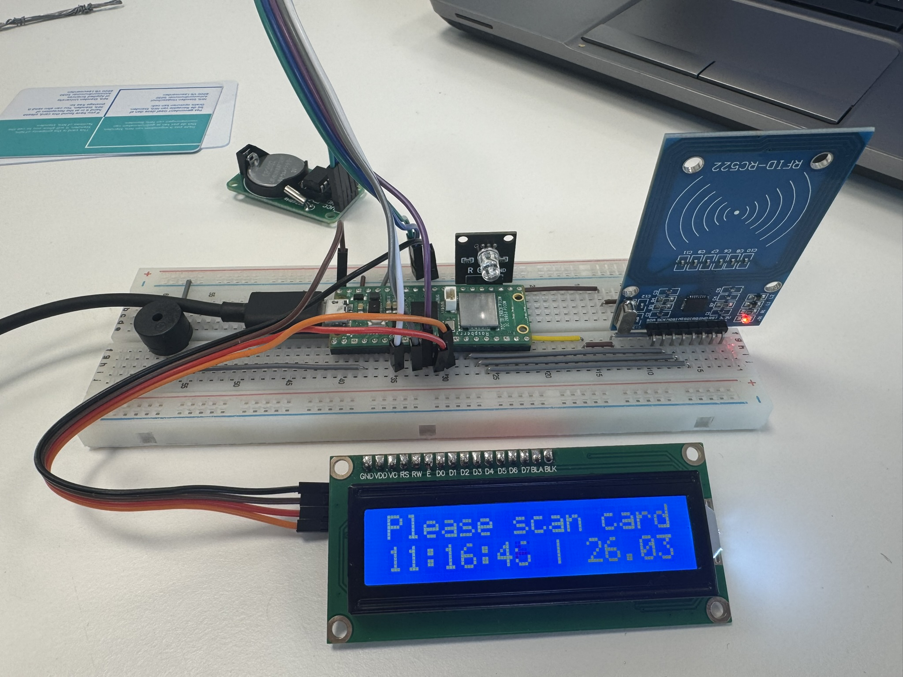
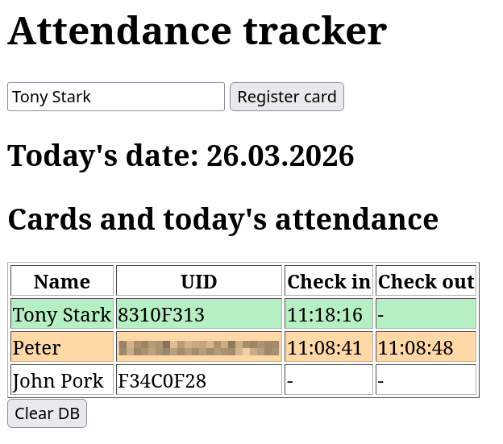


# Digital portfolio Professional Skills Y1 P3
- Name: Peter Kapsiar
- Student ID: 5486866
- Repository: https://github.com/pop9459/P3-ProfessionalSkills

## Setting & Achieving Goals: SMART(ER)
Assignment Week 1, Period 1 (02-02/06-02)

### Do you think -after this theory class- that setting SMART goals actually helps in reaching important matters?

I would say that I don't think that it's super necessary to follow an exact template at every new goal but for me personally it is a good reality check to keep in mind the theory behind the SMART method. From experience I can say that goals that are according to the SMART method are more likely to be reached. Most importantly the Specific and Time-bound aspects. It is a lot more difficult to start working on a goal if I don't know what exactly I am working towards (Specific) and if there is no time urgency (Time-bound) I am more likely to work on other things that are more urgent. 

### Describe a situation where you set a goal for yourself and took actual steps to reach this goals. Elaborate please. Just realize: you all have done this at least once in your life

I remember when I wanted to learn how to flip a butterfly knife. To do this I found a set of tutorials, each bite sized focused on one specific trick. I carefully went through the instructions, first slowly and then I gradually went faster until I could do the trick without pausing. Doing this made me think that learning a new skill is a lot easier if you just start doing it and the way to ease the initial friction is to start with very small steps which can be completed individually. I realize that this is not entirely following the SMART method but I think it shows that taking even a few smart aspects can increase your chances.

### Per category describe a goal you would like to reach.
- Short-term goal: Finish my bachelor's degree
- Long-term goal: To stay healthy as I get older
- Personal goal: Become competent in vim motions
- Professional goal: Achieve financial independence
- Relational goal: Become less socially awkward

### Now, pick one goal that is really important to reach. Describe this goal SMARTER
- **S** pecific: Maintain a healthy lifestyle by exercising, eating, sleeping, and taking care of my mental health
- **M** easurable: I will not be visibly fat and I will be mentally relaxed
- **A** cceptable: I am willing to put in the effort to achieve this
- **R** ealistic: I just need to keep conscious about this and remain real with myself
- **T** ime-bound: If I don't keep to this now, It will catch up to me later
- **E** valuate: Every now and then I will ask myself if I feel healthy and if my current state is comparable to how I was in the past 
- **R** esult/Reward: I will feel good and I will be able utilize my body and mind to their full potential even when I get older

## Prioritizing Using the Time Management Matrix
Assignment Week 4, Period 4 (02-03/06-03)

### In order to prioritise, you need to know what your values are. After all, your values determine your prioritization. So this is very personal. 

**Here are 10 lined up. Grade each one of them with either:** Very applicable to me, Applicable to me, Not applicable to me, Not applicable to me at all

- Ambition: Very applicable to me
- Reliability: Applicable to me
- Expertise: Applicable to me
- Discipline: Applicable to me
- Honesty: Applicable to me
- Health: Very applicable to me
- Independence: Very applicable to me
- Quality: Applicable to me
- Personal Growth: Very applicable to me
- Respect: Applicable to me

### Perhaps you’re not aware of this, but you have (subconsciously) prioritized in the past. If necessary dig deep and describe a situation where you had to prioritize on important matters. What (values) determined your choices? 

Currently In this period I feel like I was trying to put a lot of effort into my assignments and I was trying to do them as well as possible. I think I do value quality in this sense, I noticed that some of my classmates can just submit something (not going to name drop :P) and be done with it but I feel like I am just not able to do this. Sometimes I even feel like not submitting anything at all if I don't feel like it. It might feel like a good quality but sometimes it feels like a double edged sword because I do spend a significant amount of time on some tasks. This has lately made me push some other things aside like socializing, cooking, and working out which I don't feel that good about. I also like to watch movies and play games sometimes but I feel like I had to completely rule these things out. On the other hand in a search for more time in order to make up for more time spent on assignments I have decided I want to stop watching social media completely which I am quite happy about since it has ben on my todo list for a while. I managed to delete my instagram account, disabled all youtube recommendations (I only see videos I explicitly search for or subscribe to)

### Looking back: did you subconsciously use the Time Management Matrix in some form? Elaborate

- I have put school work in quadrant 1 - Urgent and Important
- I have put cooking and working out in quadrant 2 - Not Urgent but Important
- I have put socializing in quadrant 3 - Urgent but Not Important 
- I have put watching movies, playing games and social media in quadrant 4 - Not Urgent and Not Important
  
## Feedback
Assignment Week 6, Period 3 (16-03/20-03)

### 1. Write an essay of minimum 500 words about the importance of feedback, including at least the following topics:
- Why it’s important to be able to give proper feedback? Involve the 21st century skills also in your essay
- Why feedback is different from criticizing
- Mention the ground rules for proper feedback. Do not include the BECD-method in your answer, since this is an instrument for proper feedback, not a rule
- Describe an example of effective feedback you received in the (recent) past

I think that without feedback things become stagnant and don't change. This might sometimes work out if you are already doing well but that might not always be the case. Even if you are doing well, It can be a huge time and effectivity bonus to know that you are doing well and what parts are working well so you can keep doing those things. On the other hand if you are not doing well without feedback you first of all might not even know that you are not doing well. In this scenario you might just keep doing the same thing and eventually fail miserably. Personally I think that negative feedback is especially important. I like to think of it this way: if your ship is going in the right general direction positive feedback might just get you to your destination a little bit faster but if your ship is going in the wrong direction negative feedback is what will save you from crashing into the rocks. Despite this it might be shocking to hear that a lot of people don't like to give negative feedback just because of the word negative. People might be afraid of starting a conflict or hurting someone's feelings so they tend to just avoid the topic all together and look somewhere else. I know because, I hate to admit I too am still sometimes guilty of this behavior. I have been recently thinking about this and I recalled someone call this being the "allower". Thinking about it with that term suddenly makes it seem like you might be the wrong one in that sense and it might be some truth to it. You are not only deliberately refusing to offer someone potential benefit but you are also keeping yourself in a worse position than you could potentially be in. Now what can we do with the fear of insulting someone with our feedback. There is a method to formulate your feedback in a way that ensures that its constructive and not insulting. This is the BECD method which stands for Behavior, Effect, Change, Desired behavior. The idea is to:
- first describe what behavior you are commenting on 
- describe the effect of this behavior on you
- describe what consequences this behavior has on the environment 
- then give a suggestion on what to do about it
If you apply this template you can be confident that your feedback is not insulting and that it is constructive. However personally I think the key takeaway from this is to not just complain about something you don't like - criticizing, but also give a suggestion on how to improve it - feedback. This is what makes a feedback constructive - you construct something, not destructive - you only destroy something. 

### 2. Feedback. Write for minimum 3 of your team members a Tip and a Top according to the BECD-method. Sit down with your team and coordinate, thus making sure that each team member will receive feedback.
